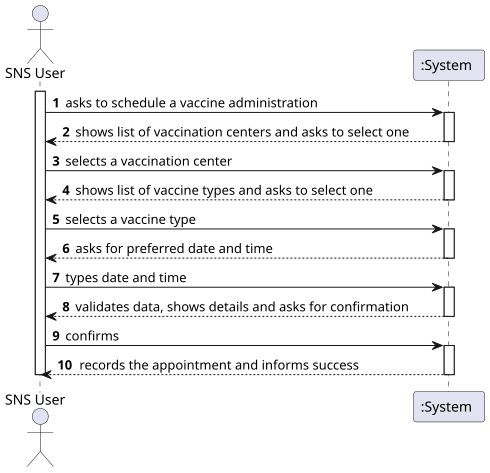
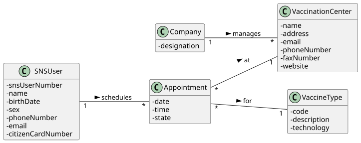
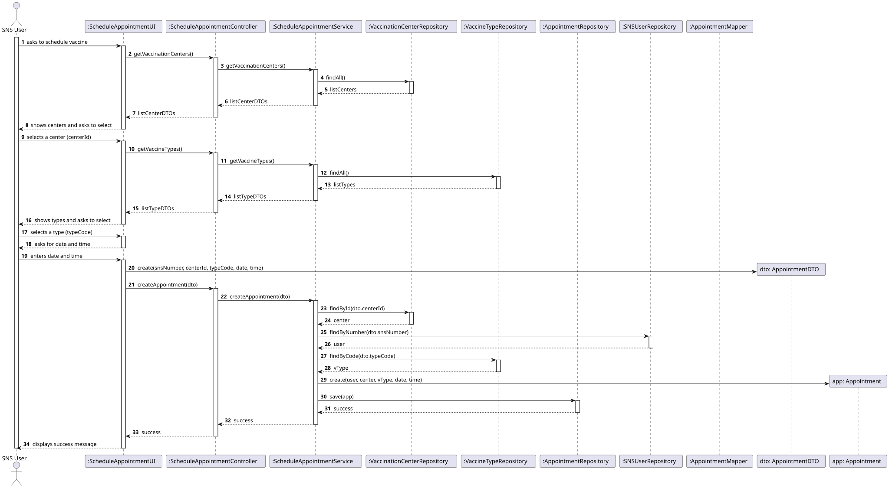
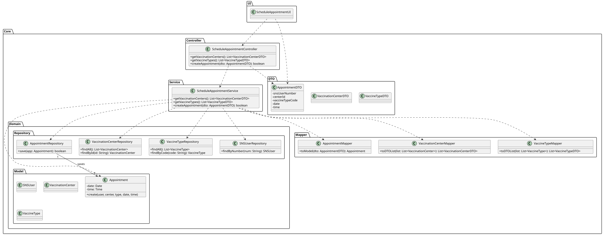

# US 21 - Schedule a vaccine administration for an SNS user

## 1. Requirements Engineering

### 1.1. User Story Description

As Receptionist, I want to schedule a vaccine administration for an SNS user.

### 1.2. Customer Specifications and Clarifications

**From the specifications document:**

> The Receptionist should be able to schedule a vaccination appointment on behalf of an SNS User at a specific Vaccination Center. The system must verify if there is availability (capacity) for the chosen time slot.

**From the client clarifications:**

> **Question:** When a receptionist schedules a vaccination on behalf of an SNS user, is this done using the receptionist's profile or the user's?
>
> **Answer:** In the case of face-to-face support where a receptionist is involved, the registration is done through the receptionist's profile/account (acting as staff), but the core scheduling logic remains similar to the self-scheduling by the SNS user.

### 1.3. Acceptance Criteria

- AC21-1: The Receptionist must identify the SNS User (e.g., by SNS Number) before scheduling.
- AC21-2: The system must present a list of available vaccination centers.
- AC21-3: The system must allow the selection of a vaccine type (if applicable).
- AC21-4: The Receptionist must select a date and time slot.
- AC21-5: The system must check the center's capacity for the selected slot before confirming the schedule.
- AC21-6: The appointment is registered in the system associated with the SNS User but performed by the Receptionist.

### 1.4. Found out Dependencies

- US13 (Register a Vaccination Center): Centers must exist to be selected.
- US10/US11 (Vaccine Types): Vaccine types must exist.
- US20 (Register SNS User): The user must be registered in the system to have an appointment scheduled.

### 1.5 Input and Output Data

**Input Data:**

- Typed data:
    - SNS User Number (to identify the beneficiary)
    - Date
    - Time Slot

- Selected data:
    - Vaccination Center
    - Vaccine Type (optional/context dependent)

**Output Data:**

- List of available centers
- List of available slots
- Appointment confirmation (success/failure)

### 1.6. System Sequence Diagram (SSD)

### 1.7 Other Relevant Remarks

- The validation of "slots" uses the same domain logic as US30: verifying capacity_per_hour against existing appointments.

## 2. OO Analysis

### 2.1. Relevant Domain Model Excerpt

### 2.2. Other Remarks

- The Receptionist acts as the initiator of the schedules action, but the created Appointment is linked to the SNS User.

## 3. Design - User Story Realization

### 3.1. Rationale

| Interaction ID | Question: Which class is responsible for... | Answer | Justification (with patterns) |
|:--- |:--- |:--- |:--- |
| Step 1 | ... interacting with the actor? | ScheduleVaccineOnBehalfUI | Pure Fabrication: responsible for user interaction (View). |
| | ... coordinating the US? | ScheduleVaccineOnBehalfController | Controller: coordinates the use case logic. |
| Step 2 | ... finding the SNS User? | SNSUserStore | IE: Manages the collection of users. |
| | ... asking for the SNS Number? | ScheduleVaccineOnBehalfUI | IE: responsible for user interaction. |
| Step 3 | ... knowing the vaccination centers? | VaccinationCenterStore | IE: Stores and manages all vaccination centers. |
| | ... providing the list of centers? | ScheduleVaccineOnBehalfController | Controller: fetches data from the store to show in UI. |
| Step 4 | ... knowing the vaccine types? | VaccineTypeStore | IE: Stores and manages vaccine types. |
| Step 5 | ... knowing the available slots? | Vaccination Center | IE: The center knows its `capacity` and its current `appointments`. |
| Step 6 | ... instantiating a new Appointment? | Vaccination Center | Creator: The `Vaccination Center` aggregates `Appointment` objects. |
| | ... validating the slot availability? | Vaccination Center | IE: It has the data (capacity vs. current count) to validate if a slot is free. |
| Step 7 | ... saving the appointment? | Vaccination Center | IE: The appointment is stored "inside" the center context. |
| Step 8 | ... informing operation success? | ScheduleVaccineOnBehalfUI | IE: responsible for user interaction. |

### Systematization

According to the taken rationale, the conceptual classes promoted to software classes are:

- Vaccination Center
- Appointment
- SNS User
- Receptionist

Other software classes (i.e. Pure Fabrication) identified:

- ScheduleVaccineOnBehalfUI
- ScheduleVaccineOnBehalfController
- VaccinationCenterStore
- VaccineTypeStore
- SNSUserStore

### 3.2. Sequence Diagram (SD)

### 3.3. Class Diagram (CD)

## 4. Tests

**Test 1:** Check that the controller correctly identifies a valid SNS User.

    TEST_F(ScheduleOnBehalfFixture, FindValidUser){
        EXPECT_NO_THROW(controller->setSNSUser(L"123456789"));
    }

**Test 2:** Check that the controller throws error for invalid SNS User.

    TEST_F(ScheduleOnBehalfFixture, FindInvalidUser){
        EXPECT_THROW(controller->setSNSUser(L"000000000"), std::invalid_argument);
    }

**Test 3:** Check that appointment creation follows the same rules as US30 (Capacity check).

    TEST_F(VaccinationCenterFixture, FailAppointmentFullCapacity){
        for(int i=0; i<center->getCapacity(); i++){
             center->createAppointment(users[i], type, date, time);
        }
        EXPECT_THROW(center->createAppointment(extraUser, type, date, time), std::runtime_error);
    }

## 5. Construction (Implementation)

- The Controller reuses the VaccinationCenter logic for slot validation, ensuring consistency with US30.

## 6. Integration and Demo

A menu option on the Receptionist's console menu was added.

    int ReceptionistMenuView::processMenuOption(int option) {
        case 1: 
            view = new ScheduleVaccineOnBehalfUI();
            view->show();
            break;
    }

## 7. Observations

- This US reuses significant logic from US30 (Scheduling) but adds the preliminary step of identifying the SNS User via SNSUserStore.