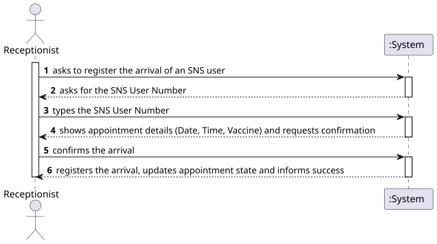
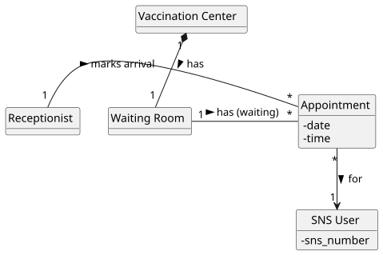
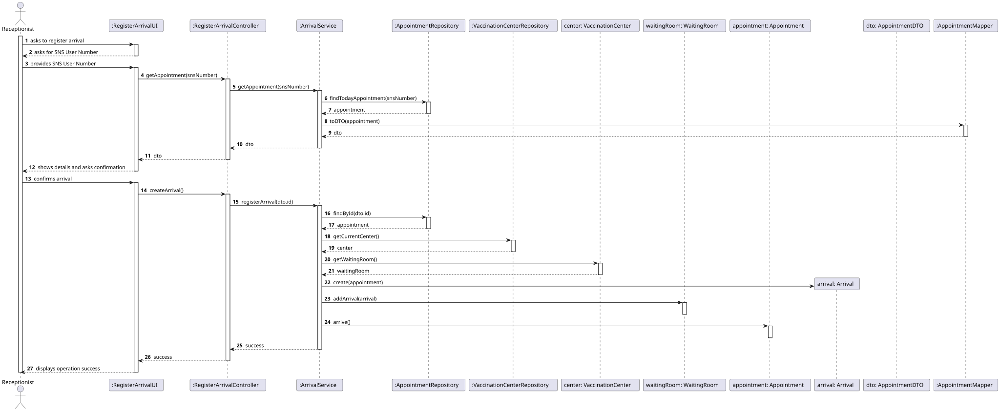
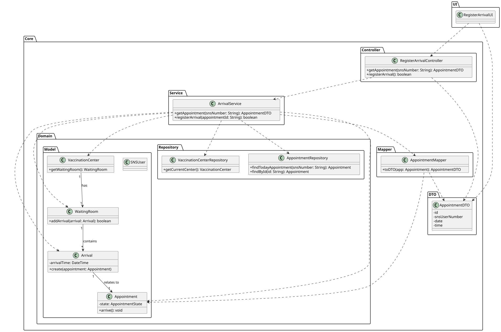

# US 22 - Register Arrival of an SNS User

## 1. Requirements Engineering

### 1.1. User Story Description

As Receptionist, I want to register the arrival of an SNS user at the vaccination center to take the vaccine.

### 1.2. Customer Specifications and Clarifications

**From the specifications document:**

> The Receptionist registers the arrival of an SNS User who has a scheduled appointment. The system must validate that the appointment exists for the current day and center.

**From the client clarifications:**

> **Question:** Is a duplicate entry check required?
>
> **Answer:** Yes. No duplicate entries should be possible for the same SNS user on the same day.
>
> **Question:** What happens after registration?
>
> **Answer:** The SNS user should be assigned to the waiting room.
>
> **Question:** Is the arrival registered if there is no appointment?
>
> **Answer:** No, the arrival can only be registered if there is a prior scheduling for that day and that center.

### 1.3. Acceptance Criteria

- AC22-1: The arrival can only be registered if an appointment exists for the SNS User, on the current date, at the current Vaccination Center.
- AC22-2: The system must verify if the user has already been registered as "arrived" on that day (prevent duplicates).
- AC22-3: Upon successful registration, the SNS User's appointment is added to the Waiting Room list.
- AC22-4: The waiting room list must support First-Come, First-Served (FIFO) ordering (ensured by the order of insertion).

### 1.4. Found out Dependencies

- US21/US30 (Schedule Vaccine): An appointment must exist to register an arrival.
- US13 (Register Vaccination Center): The center and its Waiting Room must exist.

### 1.5 Input and Output Data

**Input Data:**

- Selected data:
  - Vaccination Center (context execution)
- Typed data:
  - SNS User Number

**Output Data:**

- Confirmation of success (User added to Waiting Room) or error message (No appointment / Duplicate).

### 1.6. System Sequence Diagram (SSD)

### 1.7 Other Relevant Remarks

- The "arrival" event is conceptualized in the design by moving/adding the `Appointment` object to the `Waiting Room` container.

## 2. OO Analysis

### 2.1. Relevant Domain Model Excerpt

### 2.2. Other Remarks

- The `Waiting Room` is a component of the `Vaccination Center` (Composition).
- We reuse the `Appointment` object to represent the user in the queue, avoiding redundant classes like "Arrival", as the `Appointment` already links the User to the Center and Time.

## 3. Design - User Story Realization

### 3.1. Rationale

| Interaction ID | Question: Which class is responsible for... | Answer | Justification (with patterns) |
|:--- |:--- |:--- |:--- |
| Step 1 | ... interacting with the actor? | RegisterArrivalUI | Pure Fabrication: responsible for user interaction (View). |
| | ... coordinating the US? | RegisterArrivalController | Controller: coordinates the use case logic. |
| Step 2 | ... knowing the vaccination centers? | VaccinationCenterStore | IE: Stores and manages all vaccination centers. |
| Step 3 | ... identifying the correct center? | RegisterArrivalController | Controller: allows the receptionist to select the working center. |
| Step 4 | ... validating the appointment exists? | Vaccination Center | IE: The center owns the list of appointments and can check if one exists for the given SNS Number and Date. |
| Step 5 | ... checking for duplicate arrivals? | Waiting Room | IE: The waiting room knows who is currently inside. (Or the Center delegates this check). |
| Step 6 | ... registering the arrival? | Waiting Room | IE: The `Waiting Room` is responsible for managing its own list of waiting users. |
| | ... keeping the order (FIFO)? | Waiting Room | IE: By adding to the end of the list, the order is naturally preserved. |
| Step 7 | ... informing operation success? | RegisterArrivalUI | IE: responsible for user interaction. |

### Systematization

According to the taken rationale, the conceptual classes promoted to software classes are:

- Vaccination Center
- Waiting Room
- Appointment
- Receptionist

Other software classes (i.e. Pure Fabrication) identified:

- RegisterArrivalUI
- RegisterArrivalController
- VaccinationCenterStore

### 3.2. Sequence Diagram (SD)

### 3.3. Class Diagram (CD)

## 4. Tests

**Test 1:** Check that arrival is accepted for a user with a valid appointment today.

    TEST_F(ArrivalFixture, ValidArrival){
        // Setup: User has appointment today
        EXPECT_NO_THROW(center->registerArrival(validSnsNumber));
        EXPECT_TRUE(center->getWaitingRoom()->hasUser(validSnsNumber));
    }

**Test 2:** Check that arrival is rejected if no appointment exists.

    TEST_F(ArrivalFixture, NoAppointment){
        EXPECT_THROW(center->registerArrival(unknownSnsNumber), std::runtime_error);
    }

**Test 3:** Check that duplicate arrival is rejected (AC22-2).

    TEST_F(ArrivalFixture, DuplicateArrival){
        center->registerArrival(validSnsNumber); // First time OK
        EXPECT_THROW(center->registerArrival(validSnsNumber), std::runtime_error); // Second time Fails
    }

## 5. Construction (Implementation)

- The `Waiting Room` uses a `std::list<Appointment*>` or `std::vector<Appointment*>` to ensure insertion order is preserved, satisfying the requirement for US40 (First-Come, First-Served).

## 6. Integration and Demo

A menu option on the Receptionist's console menu was added.

    int ReceptionistMenuView::processMenuOption(int option) {
        case 3: 
            view = new RegisterArrivalUI();
            view->show();
            break;
    }

## 7. Observations

- By reusing the `Appointment` object in the Waiting Room, we avoid data duplication and ensure that the Nurse (in US40/41) has access to all appointment details (vaccine type, user info) immediately.