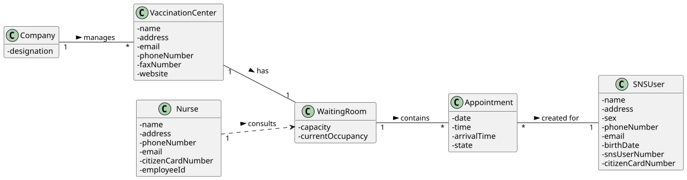

# US 40 - Consult Waiting Room

## 1. Requirements Engineering

### 1.1. User Story Description

As Nurse, I intend to consult the users in the waiting room of a vaccination center.

### 1.2. Customer Specifications and Clarifications

**From the specifications document:**

> The Nurse needs to see which users have arrived at the center and are waiting to be vaccinated.

> AC40-1: The list of SNS users should be presented on a first-come, first-served basis.

**From the client clarifications:**

> n/a 

### 1.3. Acceptance Criteria

- AC40-1: The list of users must be ordered by arrival time (First-Come, First-Served).
- AC40-2: The system must allow the Nurse to select the Vaccination Center where she is working.
- AC40-3: The list should display relevant user information (e.g., Name, Sex, Birth Date, SNS Number) to facilitate identification.

### 1.4. Found out Dependencies

- US22 (Register Arrival): Users must be registered as "arrived" to appear in the Waiting Room.
- US13 (Register Vaccination Center): The Waiting Room exists within a Center.

### 1.5 Input and Output Data

**Input Data:**

- Selected data:
  - Vaccination Center

**Output Data:**

- List of users in the waiting room (Name, SNS Number, etc.)

### 1.6. System Sequence Diagram (SSD)

### 1.7 Other Relevant Remarks

- The "First-Come, First-Served" order is guaranteed by the underlying data structure (List) populated in US22, which preserves the insertion order.

## 2. OO Analysis

### 2.1. Relevant Domain Model Excerpt

### 2.2. Other Remarks

- The Nurse interacts with the system to view the state of the Waiting Room.

## 3. Design - User Story Realization

### 3.1. Rationale

| Interaction ID | Question: Which class is responsible for... | Answer | Justification (with patterns) |
|:--- |:--- |:--- |:--- |
| Step 1 | ... interacting with the actor? | ConsultWaitingRoomUI | Pure Fabrication: responsible for user interaction (View). |
| | ... coordinating the US? | ConsultWaitingRoomController | Controller: coordinates the use case logic. |
| Step 2 | ... knowing the vaccination centers? | VaccinationCenterStore | IE: Stores and manages all vaccination centers. |
| Step 3 | ... identifying the correct center? | ConsultWaitingRoomController | Controller: allows the nurse to select the working center. |
| Step 4 | ... accessing the waiting room? | Vaccination Center | IE: The center creates and owns the `Waiting Room` (Composition). |
| Step 5 | ... retrieving the waiting list? | Waiting Room | IE: The `Waiting Room` holds the list of appointments/users waiting. |
| | ... ensuring the order (FIFO)? | Waiting Room | IE: Returns the internal list which naturally preserves the insertion order from US22. |
| Step 6 | ... presenting the data? | ConsultWaitingRoomUI | IE: responsible for user interaction. |

### Systematization

According to the taken rationale, the conceptual classes promoted to software classes are:

- Vaccination Center
- Waiting Room
- Nurse

Other software classes (i.e. Pure Fabrication) identified:

- ConsultWaitingRoomUI
- ConsultWaitingRoomController
- VaccinationCenterStore

### 3.2. Sequence Diagram (SD)

### 3.3. Class Diagram (CD)

## 4. Tests

**Test 1:** Check that the waiting list is retrieved correctly.

    TEST_F(WaitingRoomFixture, GetList){
        room->addAppointment(app1);
        room->addAppointment(app2);
        List<Appointment*> list = room->getWaitingList();
        EXPECT_EQ(list.size(), 2);
    }

**Test 2:** Check the order of the list (FIFO) - AC40-1.

    TEST_F(WaitingRoomFixture, CheckFIFOOrder){
        room->addAppointment(firstApp);
        room->addAppointment(secondApp);
        
        List<Appointment*> list = room->getWaitingList();
        EXPECT_EQ(list.front(), firstApp);
        EXPECT_EQ(list.back(), secondApp);
    }

## 5. Construction (Implementation)

- n/a

## 6. Integration and Demo

A menu option on the Nurse's console menu was added.

    int NurseMenuView::processMenuOption(int option) {
        case 1: 
            view = new ConsultWaitingRoomUI();
            view->show();
            break;
    }

## 7. Observations

- This US is purely informational but crucial for the workflow, acting as the "bridge" between the Receptionist's check-in (US22) and the Nurse's administration (US41).