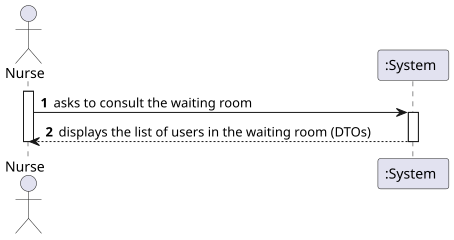
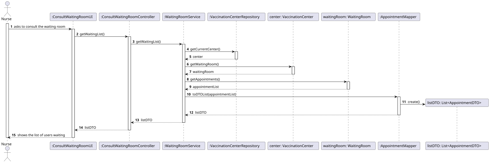
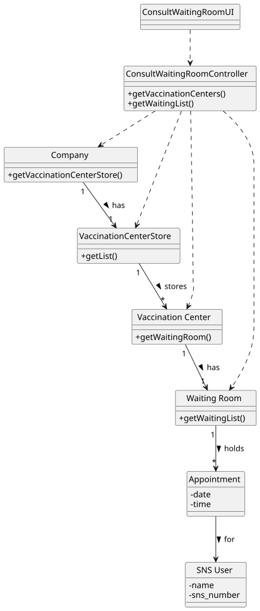

# US40 - Consult the Waiting Room

## 1. Requirements Engineering

### 1.1. User Story Description

As a Nurse, I want to consult the waiting room of the vaccination center to see which users are waiting for the vaccine administration.

### 1.2. Acceptance Criteria

* **AC1:** The list should show the users ordered by arrival time (FIFO).
* **AC2:** The displayed information must include the SNS User Name, SNS Number, and Arrival Time.
* **AC3:** Only users with the status "ARRIVED" should be in the waiting room.

### 1.3. Found out Dependencies

* **US4:** Receptionist registers the arrival of an SNS User (puts them in the waiting room).
* **US1:** It is necessary to have a Vaccination Center registered.

### 1.4 Input and Output Data

**Input Data:**
* (None - context data is used to identify the current vaccination center)

**Output Data:**
* List of users waiting (DTOs containing Name, Number, Arrival Time).

---

## 2. Analysis

### 2.1. Domain Model (MD)


---

## 3. Design

### 3.1. Realization of Functionality

The design follows the **Layered Architecture** with **Service** and **DTO** patterns:

1. **UI**: Requests the list of waiting users.
2. **Controller**: Forwards the request to the Service.
3. **Service**:
  * Retrieves the current `VaccinationCenter` from the Repository.
  * Accesses the `WaitingRoom` of that center.
  * Retrieves the list of `Appointment`s.
  * Uses a **Mapper** to convert the domain objects into `AppointmentDTO`s.
4. **Repository**: Used to fetch the Vaccination Center aggregate.

### 3.2. Sequence Diagram (SD) Rationale

| Interaction ID | Question: Which class... | Answer | Justification (with Patterns) |
| :--- | :--- | :--- | :--- |
| **Step 1** | ... interacts with the actor? | `ConsultWaitingRoomUI` | **Pure Fabrication**: Handles output to the nurse. |
| **Step 2** | ... coordinates the operation? | `ConsultWaitingRoomController` | **Controller**: Delegates to the Service layer. |
| **Step 3** | ... contains business logic? | `WaitingRoomService` | **Service Layer**: Manages the retrieval and processing of waiting room data. |
| **Step 4** | ... knows the current center? | `VaccinationCenterRepository` | **Repository**: Provides access to Center aggregates. |
| **Step 5** | ... holds the waiting list? | `WaitingRoom` | **Information Expert**: The WaitingRoom object knows which appointments are currently inside it. |
| **Step 6** | ... converts to DTO? | `AppointmentMapper` | **Pure Fabrication**: Decouples domain from data transfer format. |

### 3.3. System Diagram (SSD)



### 3.4. Sequence Diagram (SD)



### 3.5. Class Diagram (CD)



---

## 4. Tests

**Test 1:** Check if the Service returns an empty list when the waiting room is empty.

```cpp
TEST(WaitingRoomService, GetEmptyList) {
    // Mock repositories...
    WaitingRoomService service(mockRepo);
    auto list = service.getWaitingList();
    EXPECT_EQ(list.size(), 0);
}