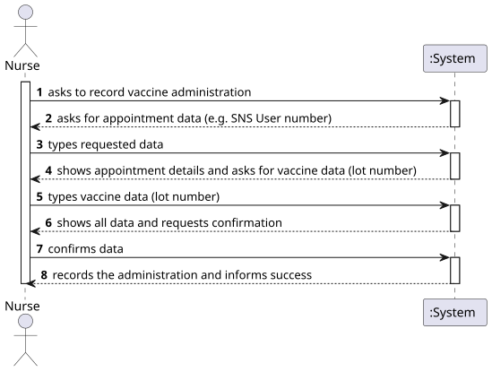
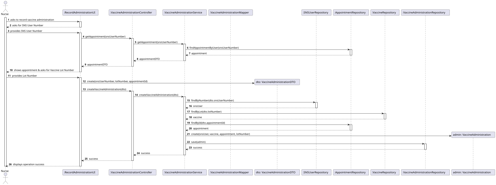
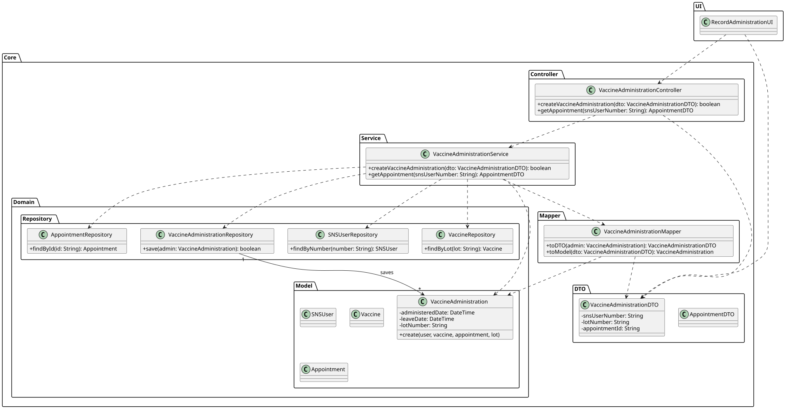

# US41 - Record the administration of a vaccine to an SNS User

## 1. Requirements Engineering

### 1.1. User Story Description

As Nurse, I want to record the administration of a vaccine to an SNS user.

### 1.2. Customer Specifications and Clarifications

> **Q**: Nesta US, no VaccinationRecord temos o atributo de adverseReaction...
> **A**: Na US41, apenas é registada a administração da vacina. O registo de reações adversas será tratado numa User Story distinta.

### 1.3. Acceptance Criteria

* **AC1:** The nurse must confirm the vaccine data (Lot number) before recording.
* **AC2:** The system should validate if the SNS User has an appointment.
* **AC3:** The administration date is automatically recorded as the current date.

### 1.4. Found out Dependencies

* **US1:** It is necessary to have vaccines registered in the system.
* **US2:** It is necessary to have SNS Users registered.
* **US21:** An appointment must exist to be fulfilled.

### 1.5 Input and Output Data

**Input Data:**
* Typed data:
  * SNS User Number
  * Vaccine Lot Number
* Selected data:
  * (none)

**Output Data:**
* Confirmation of the administration recording.

---

## 2. Analysis

### 2.1. Domain Model (MD)


---

## 3. Design

### 3.1. Realization of Functionality

The design of this User Story follows a **Layered Architecture** approach, utilizing the **DTO (Data Transfer Object)** pattern to decouple the Domain layer from the UI.

The flow consists of:
1. **UI:** Interacts with the user and collects data.
2. **Controller:** Delegates the business logic request to the Service.
3. **Service:** Orchestrates the logic. It fetches necessary entities (SNSUser, Vaccine, Appointment) from **Repositories**, creates the domain object, and saves it.
4. **DTO:** Used to transport data (SNS Number, Lot Number, etc.) between UI and Service.
5. **Repository:** Handles data persistence.

### 3.2. Sequence Diagram (SD) Rationale

| Interaction ID | Question: Which class... | Answer | Justification (with Patterns) |
| :--- | :--- | :--- | :--- |
| **Step 1** | ... interacts with the actor? | `RecordAdministrationUI` | **Pure Fabrication**: The UI handles user input/output. |
| **Step 2** | ... coordinates the operation? | `VaccineAdministrationController` | **Controller**: Entry point for the UI request. |
| | ... implements the business logic? | `VaccineAdministrationService` | **Service Layer**: Contains the logic to coordinate repositories and domain creation. |
| **Step 3** | ... finds the Appointment? | `AppointmentRepository` | **Repository**: Abstraction for retrieving Appointment aggregates. |
| | ... transfers data to UI? | `AppointmentDTO` | **DTO**: Transfers appointment data without exposing the domain entity. |
| **Step 4** | ... finds the SNS User? | `SNSUserRepository` | **Repository**: Retrieves the User aggregate. |
| | ... finds the Vaccine? | `VaccineRepository` | **Repository**: Retrieves the Vaccine based on the Lot Number. |
| **Step 5** | ... creates the Administration? | `VaccineAdministration` | **Creator**: The domain object is instantiated with the retrieved entities. |
| **Step 6** | ... saves the Administration? | `VaccineAdministrationRepository` | **Repository**: Persists the new administration record. |

### 3.3. System Diagram (SSD)



### 3.4. Sequence Diagram (SD)



### 3.5. Class Diagram (CD)



---

## 4. Tests

**Test 1:** Check if the Service creates a valid administration when data is correct.

```cpp
TEST(VaccineAdministrationService, CreateValidAdministration) {
    // Pseudocode for Service Test
    MockRepo userRepo;
    MockRepo vacRepo;
    // Service setup...
    VaccineAdministrationDTO dto("123456789", "Lot01", "App01");
    
    // bool result = service.createVaccineAdministration(dto);
    // EXPECT_TRUE(result);
}