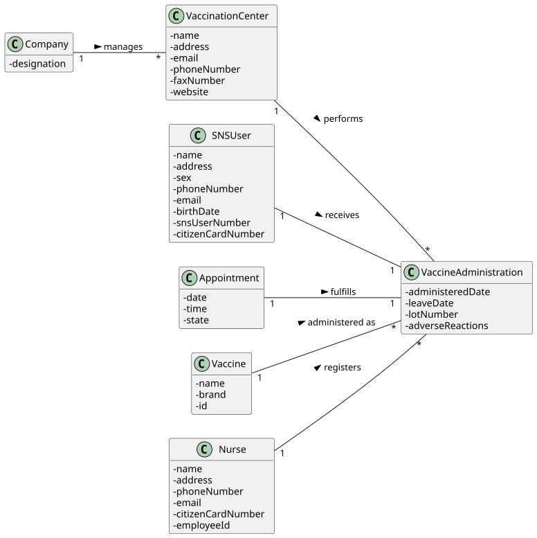

# US 41 - Record Vaccine Administration

## 1. Requirements Engineering

### 1.1. User Story Description

As Nurse, I want to record the administration of a vaccine to an SNS user.

### 1.2. Customer Specifications and Clarifications

**From the specifications document:**

> AC41-1: The nurse should select a vaccine and the administered lot number. 
> AC41-2: The SNS user should be assigned to the recovery room. 

**From the client clarifications:**

> n/a 

### 1.3. Acceptance Criteria

- AC41-1: The system must ask the nurse to select the specific vaccine (brand) and input the lot number.
- AC41-2: The available vaccines for selection must match the Vaccine Type defined in the scheduling.
- AC41-3: Upon confirmation, the user (Appointment) must be removed from the Waiting Room and added to the Recovery Room.
- AC41-4: The administration time should be recorded automatically.

### 1.4. Found out Dependencies

- US40 (Consult Waiting Room): The nurse typically selects the user from this list.
- US12 (List Vaccines): The system needs to access registered vaccines to allow selection.
- US13 (Register Center): The Recovery Room must exist.

### 1.5 Input and Output Data

**Input Data:**

- Selected data:
  - Vaccine (Brand)
- Typed data:
  - Lot Number

**Output Data:**

- Confirmation of success (User moved to Recovery Room).

### 1.6. System Sequence Diagram (SSD)

### 1.7 Other Relevant Remarks

- The logical flow implies that the Appointment object acts as the carrier of information, accumulating data (scheduling info -> arrival time -> administration info) as it moves through the center's rooms.

## 2. OO Analysis

### 2.1. Relevant Domain Model Excerpt

### 2.2. Other Remarks

- The Recovery Room is structurally identical to the Waiting Room (a container of Appointments), but represents a different state in the vaccination process.

## 3. Design - User Story Realization

### 3.1. Rationale

| Interaction ID | Question: Which class is responsible for... | Answer | Justification (with patterns)                                                          |
|:--- |:--- |:--- |:---------------------------------------------------------------------------------------|
| Step 1 | ... interacting with the actor? | RecordAdministrationUI | Pure Fabrication: responsible for user interaction (View).                             |
| | ... coordinating the US? | RecordAdministrationController | Controller: coordinates the use case logic.                                            |
| Step 2 | ... knowing the available vaccines? | VaccineStore | IE: Stores all vaccines.                                                               |
| | ... filtering vaccines by type? | VaccineStore | IE: It has the data to perform the query.                                              |
| Step 3 | ... saving administration details? | Appointment | IE: The appointment object aggregates all data related to the event (Who, When, What). |
| Step 4 | ... moving the user to recovery? | Vaccination Center | IE: The Center owns both rooms (Waiting and Recovery) and orchestrates the transfer.   |
| Step 5 | ... adding to recovery room? | Recovery Room | IE: Manages its own list of recovering users.                                          |
| Step 6 | ... informing operation success? | RecordAdministrationUI | IE: responsible for user interaction.                                                  |

### Systematization

According to the taken rationale, the conceptual classes promoted to software classes are:

- Vaccination Center
- Recovery Room
- Waiting Room
- Appointment
- Vaccine

Other software classes (i.e. Pure Fabrication) identified:

- RecordAdministrationUI
- RecordAdministrationController
- VaccineStore

### 3.2. Sequence Diagram (SD)

### 3.3. Class Diagram (CD)

## 4. Tests

**Test 1:** Check that administration details are saved correctly.

    TEST_F(AppointmentFixture, RecordDetails){
        app->addAdministrationInfo(vaccinePfizer, "L12345", now());
        EXPECT_EQ(app->getLotNumber(), "L12345");
    }

**Test 2:** Check that the user is moved between rooms correctly (AC41-2).

    TEST_F(CenterFixture, MoveToRecovery){
        center->getWaitingRoom()->add(app);

        center->moveUserToRecovery(app);

        EXPECT_FALSE(center->getWaitingRoom()->contains(app));
        EXPECT_TRUE(center->getRecoveryRoom()->contains(app));
    }

## 5. Construction (Implementation)

- The VaccineStore should implement a method getVaccinesByType(VaccineType type) to prevent the nurse from selecting a Flu vaccine for a Covid-19 appointment.

## 6. Integration and Demo

A menu option on the Nurse's console menu was added.

    int NurseMenuView::processMenuOption(int option) {
        case 2:
            view = new RecordAdministrationUI(selectedAppointment);
            view->show();
            break;
    }

## 7. Observations

- This US completes the physical flow of the user inside the vaccination center (Arrival -> Wait -> Administer -> Recovery).