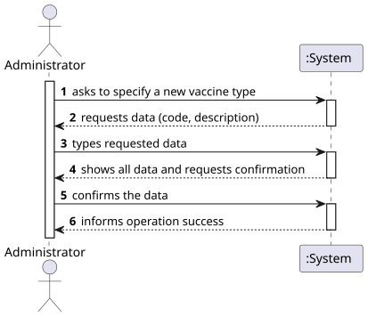
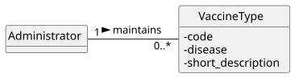
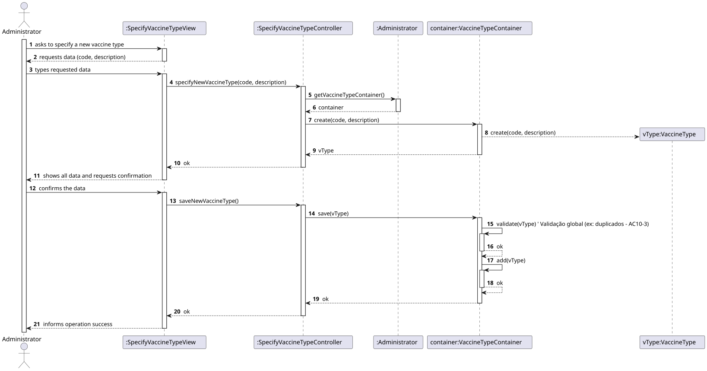
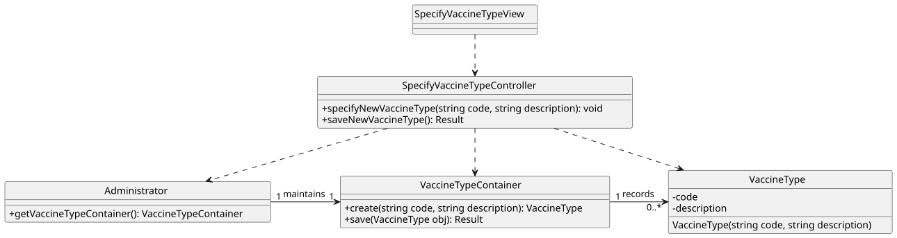

# US 01 - Create a category

## 1. Requirements Engineering

### 1.1. User Story Description

As Administrator, I want to specify a new vaccine type.

### 1.2. Customer Specifications and Clarifications 

**From the specifications document:**

> By simplicity, a category just comprehends a unique alphanumeric code and a brief description.

**From the client clarifications:**

> **Question:** What defines a “type of vaccine”?
>
> **Answer:** We assume that, like Category, a “vaccine type” (or technology) is defined by a unique alphanumeric code (e.g., ‘MRNA’) and a description (e.g., “Messenger RNA vaccine”).

### 1.3. Acceptance Criteria

- AC10-1: The vaccine type code cannot be empty and must have a maximum of 10 characters.
- AC10-2: The description cannot be empty.
- AC10-3: The vaccine type code must be unique in the system (global validation).

### 1.4. Found out Dependencies

- No US11 (“Register a vaccine”) has a direct dependency on this US, as it requires the vaccine technology to be selected from a predefined list, which is managed by this US (US10).

### 1.5 Input and Output Data

**Input Data:**

- Typed data:
    - a code
    - a description

- Selected data:
    - n/a

**Output Data:**

- (In)success of the operation

### 1.6. System Sequence Diagram (SSD)

### 1.7 Other Relevant Remarks

- The created category is ready to be used in task categorization.

## 2. OO Analysis

### 2.1. Relevant Domain Model Excerpt 

### 2.2. Other Remarks

- For this US, the Administrator is the class/actor responsible for managing vaccine types. For this US, the Administrator is the class/actor responsible for managing vaccine types.

## 3. Design - User Story Realization 

### 3.1. Rationale

| Interaction ID | Question: Which class is responsible for...       | Answer                       | Justification (with patterns)                                                                                                                                                                                                                |
|:---------------|:--------------------------------------------------|:-----------------------------|:---------------------------------------------------------------------------------------------------------------------------------------------------------------------------------------------------------------------------------------------|
| Step 1  		     | 	... interacting with the actor?                  | SpecifyVaccineTypeView       | Pure Fabrication: there is no reason to assign this responsibility to any existing class in the Domain Model.                                                                                                                                |
| 			  		        | 	... coordinating the US?                         | SpecifyVaccineTypeController | Controller                                                                                                                                                                                                                                   |
| Step 2  		     | 	... requesting data?				                         | SpecifyVaccineTypeView       | IE: is responsible for user interactions.                                                                                                                                                                                                    |
| Step 3         | ... saving the inputted data?                     | SpecifyVaccineTypeView       | IE: is responsible for keeping the inputted data.                                                                                                                                                                                            |
| Step 4         | ... showing all data and requesting confirmation? | SpecifyVaccineTypeView       | IE: is responsible for user interactions.                                                                                                                                                                                                    |              
| Step 5         | ... instantiating a new category?                 | Administrator                | Creator (Rule 1): In the Domain Model, Administrator contains VaccineType.                                                                                                                                                                   |
| 			  		        | 	                                                 | VaccineTypeContainer         | By applying High Cohesion (HC) + Low Coupling (LC) in the Administrator class, it delegates responsibility to VaccineTypeContainer.                                                                                                          |
| 			  		 | ... knowing the CategoryContainer?               | Administrator                | IE: Administrator knows the VaccineTypeContainer to which it delegates responsibilities.                                                                                                                                                     |
|                | ... validating all data (local validation)?       | VaccineType                  | IE: (Information Expert) has its own data (code, description) and must validate itself in the constructor.                                                                                                                                   |
|                | ... validating all data (global validation)?      | VaccineTypeContainer         | IE: knows all VaccineTypes.                                                                                                                                                                                                                  |
|                | ... saving the created category?                  | VaccineTypeContainer         | IE: is the “container” for all types of vaccines.                                                                                                                                                                                            |
| Step 6         | ... informing operation success?                  | SpecifyVaccineTypeView           | IE: is responsible for interactions with the user.                                                                                                                                                                                           |

### Systematization

According to the taken rationale, the conceptual classes promoted to software classes are:

- Person
- Category

Other software classes (i.e. Pure Fabrication) identified:

- CreateCategoryView
- CreateCategoryController
- CategoryContainer

### 3.2. Sequence Diagram (SD)

**Alternative 1**

### 3.3. Class Diagram (CD)

## 4. Tests

Three relevant test scenarios are highlighted next.
Other test were also specified.

**Test 1:** Check that it is not possible to create an instance of the Category class with invalid values. 

     TEST_F(VaccineTypeFixture, CreateWithEmptyCode){
        // Tenta criar um tipo de vacina com código vazio
        EXPECT_THROW(new VaccineType(L"", L"Messenger RNA"), std::invalid_argument);
    }

    TEST_F(VaccineTypeFixture, CreateWithEmptyDescription){
        // Tenta criar um tipo de vacina com descrição vazia
        EXPECT_THROW(new VaccineType(L"MRNA", L""), std::invalid_argument);
    }

**Test 2:** Check that it is possible to create an instance of the Category class with valid values.

      TEST_F(VaccineTypeFixture, CreateWithValidData){
        // Tenta criar um tipo de vacina com dados válidos
        EXPECT_NO_THROW(new VaccineType(L"MRNA", L"Messenger RNA vaccine"));
    }

**Test 3:** Check that it is possible create and add/save a category on the container.
    
      TEST_F(VaccineTypeContainerFixture, AddingOneVaccineType){
        // Verifica se o container está vazio no início
        EXPECT_TRUE(this->container->isEmpty());

        // Cria e guarda um novo tipo de vacina
        shared_ptr<VaccineType> vType = this->container->create(L"VEC01", L"Vector Vaccine");
        this->container->save(vType);

        // Verifica se o container já não está vazio
        EXPECT_FALSE(this->container->isEmpty());
    }

## 5. Construction (Implementation)

- n/a

## 6. Integration and Demo 

A menu option on the console application was added. Such option invokes the CreateCategoryView.

    int AdminMenuView::processMenuOption(int option) {
    int result = 0;
    BaseView * view;
    switch (option) {
    
    // Assumindo que 1 é a opção "Specify Vaccine Type"
    case 1: 
        view = new SpecifyVaccineTypeView(this->userToken);
        view->show();
        break;
    ...
    }
    return result;
}
      

## 7. Observations

- n/a