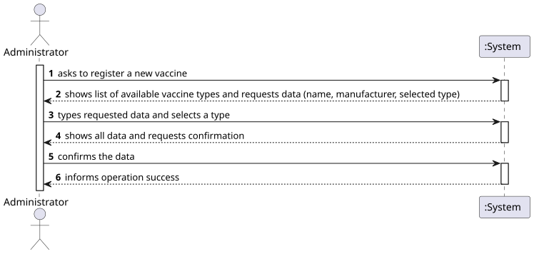
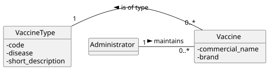
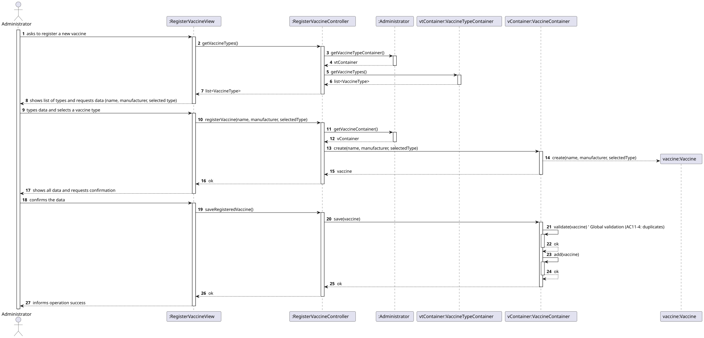

# US 11 - Register a vaccine

## 1. Requirements Engineering

### 1.1. User Story Description

As Administrator, I want to register a vaccine.

### 1.2. Customer Specifications and Clarifications 

**From the specifications document:**

> AC11-1: The vaccine technology must be selected from a predefined list of available types

**From the client clarifications:**

> **Question:**  What defines a "vaccine"?
> 
> **Answer:** We assume that, like Category, a “vaccine type” (or technology) is defined by a unique alphanumeric code (e.g., ‘MRNA’) and a description (e.g., “Messenger RNA vaccine”).

### 1.3. Acceptance Criteria

- AC11-1: The vaccine technology must be selected from the predefined list of available vaccine types.
- AC11-2: The vaccine name cannot be empty.
- AC11-3: The vaccine manufacturer cannot be empty.
- AC11-4: The combination of vaccine name and manufacturer must be unique within the system (global validation).

### 1.4. Found out Dependencies

- US10 (Specify a new vaccine type): This US is highly dependent on US10, as the list of vaccine types must exist and be retrieved to fulfill AC11-1.
### 1.5 Input and Output Data

**Input Data:**

- Typed data:
    - a code
    - a manufacturer

- Selected data:
    - a VaccineType

**Output Data:**

- (In)success of the operation

### 1.6. System Sequence Diagram (SSD)

### 1.7 Other Relevant Remarks

- n/a

## 2. OO Analysis

### 2.1. Relevant Domain Model Excerpt 

### 2.2. Other Remarks

- The model shows that a Vaccine cannot exist without being associated with a VaccineType. This fulfills the requirement AC11-1.

## 3. Design - User Story Realization 

### 3.1. Rationale

| Interaction ID | Question: Which class is responsible for...       | Answer                    | Justification (with patterns)                                                                                                                                                                                                                                |
|:---------------|:--------------------------------------------------|:--------------------------|:-------------------------------------------------------------------------------------------------------------------------------------------------------------------------------------------------------------------------------------------------------------|
| Step 1  		     | 	... interacting with the actor?                  | RegisterVaccineView       | Pure Fabrication: there is no reason to assign this responsibility to any existing class in the Domain Model.                                                                                                                                                |
| 			  		        | 	... coordinating the US?                         | RegisterVaccineController | Controller                                                                                                                                                                                                                                                   |
| Step 2  		     | 	... fetching the list of vaccine types?				      | RegisterVaccineController | Controller: coordinates the data retrieval.                                                                                                                                                                                                                  |
|                | ... knowing the VaccineTypeContainer?             | Administrator             | IE: The Admin is the root entity, manages all domain containers.                                                                                                                                                                                             |
|                | .... providing the list of vaccine types?         | VaccineTypeContainer      | IE: This container owns the collection of VaccineType objects.                                                                                                                                                                                               |              
|                | ... showing the list and requesting data?         | RegisterVaccineView       | IE: responsible for all user interaction.                                                                                                                                                                                                                    |
| 		Step 3 			   | 	   ... saving the inputted data?                 | RegisterVaccineView       | IE: keeps the data inputted by the user.                                                                                                                                                                                                                                                             |
| 			Step 4   		 | ... showing all data and requesting confirmation? | RegisterVaccineView       | IE: responsible for user interaction.                                                                                                                                                                     |
| Step 5         | ... instantiating a new vaccine?                | Administrator             | Creator (Rule 1): In the DM, Administrator maintains Vaccine.                                                                                                                                                   |
|                |                                                   | VaccineContainer          | By applying HC + LC, Administrator delegates this to a dedicated VaccineContainer.                                                                                                                                                                                                                                |
|                |... knowing the VaccineContainer?                | Administrator             | IE: Knows its delegate containers.                                                                                                                                                                                                           |
|                | ... validating all data (local validation)?               | Vaccine                   | IE: Owns its data (name, manufacturer, type) and validates them in its constructor (AC11-2, AC11-3).                                                                                                                                                                                                           |
|                | ... validating all data (global validation)?               | VaccineContainer          | IE: Knows all Vaccine objects and can check for duplicates (AC11-4).                                                                                                                                                                                                          |
|                | ... saving the created vaccine?              | 	VaccineContainer         | IE: Owns the collection of Vaccine objects.                                                                                                                                                                                                          |
| Step 6         | ... informing operation success?              | RegisterVaccineView      | IE: responsible for user interaction.                                                                                                                                                                                                         |

### Systematization

According to the taken rationale, the conceptual classes promoted to software classes are:

- Administrator
- Vaccine

Other software classes (i.e. Pure Fabrication) identified:

- RegisterVaccineView
- RegisterVaccineController
- VaccineContainer
- VaccineTypeContainer

### 3.2. Sequence Diagram (SD)

**Alternative 1**

### 3.3. Class Diagram (CD)

## 4. Tests

Three relevant test scenarios are highlighted next.
Other test were also specified.

**Test 1:** Check that it is not possible to create an instance of the Vaccine class with invalid or missing values (validates AC11-1, AC11-2, AC11-3). 

     TEST_F(VaccineFixture, CreateWithEmptyName){
        // Assumes 'this->validType' is a valid shared_ptr<VaccineType> from the fixture
        EXPECT_THROW(new Vaccine(L"", L"Pfizer-BioNTech", this->validType), std::invalid_argument);
    }

    TEST_F(VaccineFixture, CreateWithEmptyManufacturer){
        EXPECT_THROW(new Vaccine(L"Comirnaty", L"", this->validType), std::invalid_argument);
    }

    TEST_F(VaccineFixture, CreateWithNullType){
        // Validates that a VaccineType must be provided (AC11-1)
        EXPECT_THROW(new Vaccine(L"Comirnaty", L"Pfizer-BioNTech", nullptr), std::invalid_argument);
    }

**Test 2:** Check that it is possible to create an instance of the Vaccine class with valid values.

      TEST_F(VaccineFixture, CreateWithValidData){
        EXPECT_NO_THROW(new Vaccine(L"Comirnaty", L"Pfizer-BioNTech", this->validType));
    }

**Test 3:** Check that it is possible to create and add/save a vaccine to the container.
    
    TEST_F(VaccineContainerFixture, AddingOneVaccine){
        // Assumes 'this->validType' is available from the fixture
        EXPECT_TRUE(this->container->isEmpty());
        
        shared_ptr<Vaccine> vax = this->container->create(L"Comirnaty", L"Pfizer-BioNTech", this->validType);
        this->container->save(vax);
        
        EXPECT_FALSE(this->container->isEmpty());
    }

**Test 4:** Check that the system rejects saving a vaccine with a name/manufacturer combination that already exists (validates AC11-4).

    TEST_F(VaccineContainerFixture, FailToSaveDuplicateVaccine){
        // Setup: Save the first vaccine
        shared_ptr<Vaccine> vax1 = this->container->create(L"Spikevax", L"Moderna", this->validType);
        this->container->save(vax1);
        
        // Attempt: Create and try to save a second vaccine with the same unique data
        shared_ptr<Vaccine> vax2 = this->container->create(L"Spikevax", L"Moderna", this->validType);

        // Verify: The 'save' method should detect the duplicate and throw an exception
        EXPECT_THROW(this->container->save(vax2), std::runtime_error); // Or similar exception for validation failure
    }

## 5. Construction (Implementation)

- n/a

## 6. Integration and Demo 

A menu option on the Administrator's console menu was added. This option invokes the RegisterVaccineView.

    int AdminMenuView::processMenuOption(int option) {
    int result = 0;
    BaseView * view;
    switch (option) {

    case 2: 
        view = new RegisterVaccineView(this->userToken);
        view->show();
        break;
    ...
    }
    return result;
}
      

## 7. Observations

- This User Story demonstrates how a Controller can coordinate retrieving data from one source (VaccineTypeContainer) to be used in the creation of a new, different entity (Vaccine).