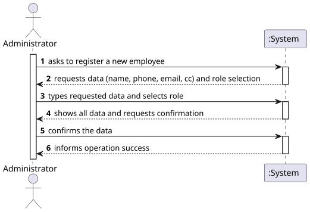
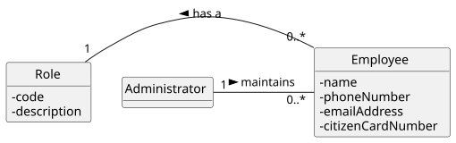
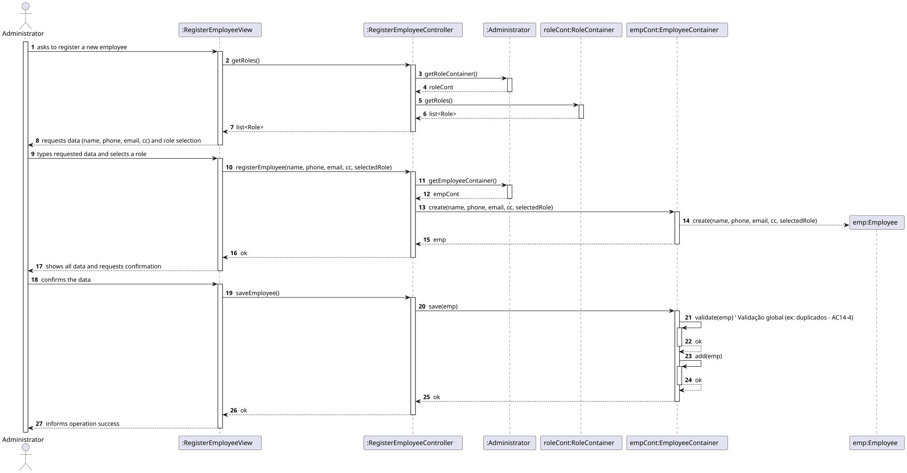
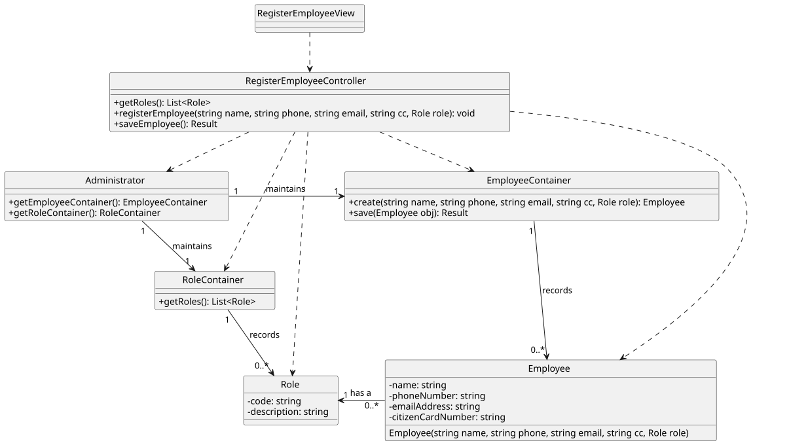

# US 14 - Register an employee

## 1. Requirements Engineering

### 1.1. User Story Description

As Administrator, I want to register an employee.

### 1.2. Customer Specifications and Clarifications

**From the specifications document:**

> AC14-1: Each employee must be assigned a single function/role within the system. 
> AC14-2: The attributes Name, Phone Number, and E-mail Address are mandatory. 
> AC14-3: The Phone Number and Citizen Card Number must comply with the Portuguese format. 
> AC14-4: The Phone Number and E-mail Address must be unique across all registered employees. 

**From the client clarifications:**

> **Question:** What defines an "employee" and their "role"?
>
> **Answer:** We assume an employee is defined by several attributes, including a unique Phone Number and Email. The "role" (e.g., "Nurse", "Receptionist") is selected from a predefined list, and each employee must have exactly one.

### 1.3. Acceptance Criteria

-   **AC14-1:** Each employee must be assigned a single function/role within the system. 
-   **AC14-2:** The attributes Name, Phone Number, and E-mail Address are mandatory. 
-   **AC14-3:** The Phone Number and Citizen Card Number must comply with the Portuguese format. 
-   **AC14-4:** The Phone Number and E-mail Address must be unique across all registered employees (global validation). 
-   **AC14-5 (derived):** Name cannot be empty.
-   **AC14-6 (derived):** Phone Number must have 9 digits and start with '9' (Portuguese mobile format).
-   **AC14-7 (derived):** E-mail Address must be in a valid format (e.g., `user@domain.com`).
-   **AC14-8 (derived):** Citizen Card Number must have 9 alphanumeric characters (Portuguese format).
-   **AC14-9 (derived):** A Role must be selected from the list.

### 1.4. Found out Dependencies

-   US16 (“As Administrator, I want to get a list of employees assigned to a specific function/role”)  has a direct dependency on this US. This US creates the employees and assigns them the roles that US16 will use for filtering.

### 1.5 Input and Output Data

**Input Data:**

-   Typed data:
    -   Name
    -   Phone Number
    -   E-mail Address
    -   Citizen Card Number
-   Selected data:
    -   A Role (from a list of available roles)

**Output Data:**

-   (In)success of the operation

### 1.6. System Sequence Diagram (SSD)

### 1.7 Other Relevant Remarks

-   The registered employee is ready to be listed and perform functions in the system.

---

## 2. OO Analysis

### 2.1. Relevant Domain Model Excerpt

### 2.2. Other Remarks

-   For this US, the Administrator is the class/actor responsible for managing (maintaining) the list of employees.

---

## 3. Design - User Story Realization

### 3.1. Rationale

| Interaction ID | Question: Which class is responsible for... | Answer | Justification (with patterns) |
|:--- |:--- |:--- |:--- |
| Step 1 | ... interacting with the actor? | `RegisterEmployeeView` | Pure Fabrication: there is no reason to assign this responsibility to any existing class in the Domain Model. |
| | ... coordinating the US? | `RegisterEmployeeController` | Controller |
| Step 2 | ... getting the list of roles to show? | `RegisterEmployeeController` | Controller: Coordinates the step. Delegates to Admin to get the container. |
| | ... knowing the `RoleContainer`? | `Administrator` | IE: Administrator "maintains" (knows) the `RoleContainer`. |
| | ... retrieving the list of roles? | `RoleContainer` | IE: Is the "container" for all `Role` objects. |
| Step 3 | ... requesting data and role selection? | `RegisterEmployeeView` | IE: is responsible for user interactions. |
| Step 4 | ... saving the inputted data? | `RegisterEmployeeView` | IE: is responsible for keeping the inputted data. |
| Step 5 | ... showing all data and requesting confirmation? | `RegisterEmployeeView` | IE: is responsible for user interactions. |
| Step 6 | ... instantiating a new employee? | `Administrator` | Creator (Rule 1): In the Domain Model, Administrator "maintains" Employees. |
| | | `EmployeeContainer` | By applying High Cohesion (HC) + Low Coupling (LC) in the Administrator class, it delegates responsibility to `EmployeeContainer`. |
| | ... knowing the `EmployeeContainer`? | `Administrator` | IE: knows the `EmployeeContainer` to which it delegates responsibilities. |
| | ... validating all data (local validation)? | `Employee` | IE: (Information Expert) has its own data (name, phone, etc.) and must validate itself in the constructor. (AC14-2, AC14-3, AC14-5, etc.) |
| | ... validating all data (global validation)? | `EmployeeContainer` | IE: knows all Employees and can check for uniqueness. (AC14-4) |
| | ... saving the created employee? | `EmployeeContainer` | IE: is the "container" for all `Employee` objects. |
| Step 7 | ... informing operation success? | `RegisterEmployeeView` | IE: is responsible for interactions with the user. |

### Systematization

According to the taken rationale, the conceptual classes promoted to software classes are:

-   `Employee`
-   `Role`

Other software classes (i.e. Pure Fabrication) identified:

-   `RegisterEmployeeView`
-   `RegisterEmployeeController`
-   `EmployeeContainer`
-   `RoleContainer` (assumed to exist for Role management)

### 3.2. Sequence Diagram (SD)

### 3.3. Class Diagram (CD)

---

## 4. Tests

Three relevant test scenarios are highlighted next.
Other tests were also specified.

**Test 1:** Check that it is not possible to create an instance of the Employee class with invalid/missing values.

    TEST_F(EmployeeFixture, CreateWithEmptyName){
        // Tenta criar um funcionário com nome vazio
        EXPECT_THROW(new Employee(L"", L"912345678", L"test@test.com", L"12345678A", this->nurseRole), std::invalid_argument);
    }

    TEST_F(EmployeeFixture, CreateWithInvalidPhoneFormat){
        // Tenta criar um funcionário com formato de telemóvel inválido
        EXPECT_THROW(new Employee(L"Ana", L"123", L"test@test.com", L"12345678A", this->nurseRole), std::invalid_argument);
    }

**Test 2:** Check that it is possible to create an instance of the Employee class with valid values.

    TEST_F(EmployeeFixture, CreateWithValidData){
        // Tenta criar um funcionário com dados válidos
        EXPECT_NO_THROW(new Employee(L"Ana", L"912345678", L"test@test.com", L"12345678A", this->nurseRole));
    }

**Test 3:** Check that it is not possible to save an employee if their email or phone already exists in the container.

    TEST_F(EmployeeContainerFixture, FailToSaveWithDuplicateEmail){
        // Cria e guarda um primeiro funcionário
        shared_ptr<Employee> emp1 = this->container->create(L"Ana", L"912345678", L"duplicate@test.com", L"12345678A", this->nurseRole);
        this->container->save(emp1);

        // Tenta criar e guardar um segundo funcionário com o MESMO email
        shared_ptr<Employee> emp2 = this->container->create(L"Rui", L"960000000", L"duplicate@test.com", L"98765432B", this->receptionistRole);
        
        // Verifica que o 'save' lança uma exceção (validação global)
        EXPECT_THROW(this->container->save(emp2), std::runtime_error);
    }

---

## 5. Construction (Implementation)

-   n/a

## 6. Integration and Demo

A menu option on the console application was added. Such option invokes the `RegisterEmployeeView`.

    int AdminMenuView::processMenuOption(int option) {
    int result = 0;
    BaseView * view;
    switch (option) {
    
    // Assumindo que 1 é "Specify Vaccine Type"
    // Assumindo que 2 é a opção "Register Employee"
    case 2: 
        view = new RegisterEmployeeView(this->userToken);
        view->show();
        break;
    ...
    }
    return result;
}

---

## 7. Observations

-   n/a