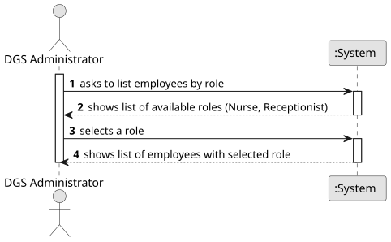
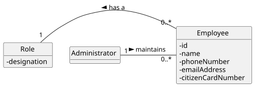
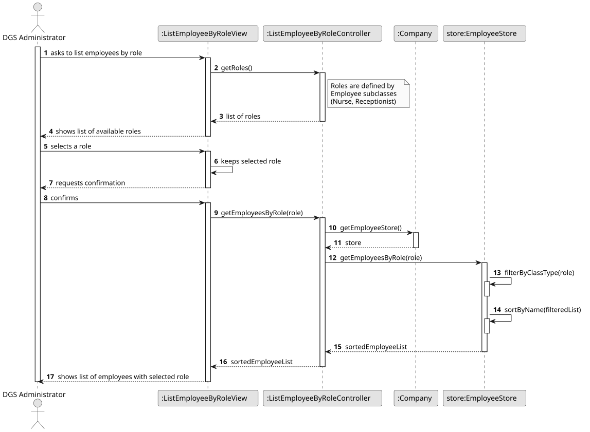
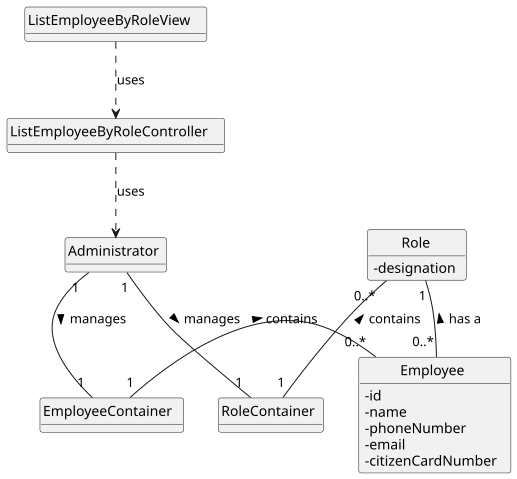

# US 15 - Get a list of employees assigned to a specific function/role

## 1. Requirements Engineering

### 1.1. User Story Description

As Administrator, I want to get a list of employees assigned to a specific function/role.

### 1.2. Customer Specifications and Clarifications

**From the specifications document:**

> Each employee has a single, mandatory function/role: RECEPTIONIST, NURSE, or ADMINISTRATOR.
> Administrators can view employees and their assigned roles.
> The role must be selected from predefined values.
> Employee data includes name, phone number, email, citizen card number, postal address, and system-generated ID.

**From the client clarifications:**

> **Question:** Can Administrators list all employees, or only those of one role at a time?
>
> **Answer:** Only one role at a time; listing all employees can be another US.
> 
> > **Question:** What data must appear in the returned list?
>
> **Answer:** At minimum: ID, Name, Role, Phone, Email. Additional fields are optional.

### 1.3. Acceptance Criteria

- AC15-1: The system must allow the Administrator to select exactly one valid role from the predefined list.
- AC15-2: The system must return all employees who match the selected role.
- AC15-3: If no employees exist for the selected role, an empty list must be returned.
- AC15-4: Returned employees must be sorted in ascending order by name.
- AC15-5: For each employee, the system must return the following fields: ID, Name, Phone Number, E-mail Address, and Role.

### 1.4. Found out Dependencies

- Depends on EmployeeContainer (must store employees and allow filtering).
- Depends on Employee.
- Depends on the role enumeration defined in US14.
- Can be implemented after US14 is completed (since listing requires employees to already exist).

### 1.5 Input and Output Data

**Input Data:**

- Typed data:
    - a code
    - a description

- Selected data:
    - receptionist
    - nurse
    - adminstrator

**Output Data:**

- employee
- name
- phoneNumber
- email
- role

### 1.6. System Sequence Diagram (SSD)

### 1.7 Other Relevant Remarks

- No authentication handling needed for now (mocked).
- This US does not edit or delete employees—only queries.

## 2. OO Analysis

### 2.1. Relevant Domain Model Excerpt

### 2.2. Other Remarks

- EmployeeContainer is the Information Expert for "list all employees by role".

## 3. Design - User Story Realization

### 3.1. Rationale

| Interaction ID | Question: Which class is responsible for...     | Answer                       | Justification (with patterns)                                                                                                |
|:---------------|:------------------------------------------------|:-----------------------------|:-----------------------------------------------------------------------------------------------------------------------------|
| Step 1         | ... interacting with the administrator?         | ListEmployeeByRoleView       | Pure Fabrication: there is no reason to assign this responsibility to any existing class in the Domain Model.                |
|                | ... coordinating the US?                        | ListEmployeeByRoleController | Controller                                                                                                                   |
| Step 2         | ... requesting the role selection?              | ListEmployeeByRoleView       | IE: is responsible for user interactions.                                                                                    |
| Step 3         | ... saving the selected role?                   | ListEmployeeByRoleView       | IE: is responsible for keeping the inputted data.                                                                            |
| Step 4         | ... knowing which employees match the role?     | EmployeeContainer            | IE: knows all employees and can filter by role.                                                                              |
|                | ... delegating to EmployeeContainer?            | Administrator                | By applying High Cohesion and Low Coupling, the Administrator delegates responsibility to EmployeeContainer.                 |
|                | ... knowing the EmployeeContainer?              | Administrator                | IE: Administrator knows the EmployeeContainer to which it delegates responsibilities.                                        |
|                | ... sorting employees by name?                  | EmployeeContainer            | IE: has access to all employees and can apply sorting logic (AC15-4).                                                        |
| Step 5         | ... formatting employee data for display?       | ListEmployeeByRoleController | Controller: coordinates the transformation of domain data into a format suitable for the view (ID, Name, Phone, Email, Role).|
| Step 6         | ... displaying the list of employees?           | ListEmployeeByRoleView       | IE: is responsible for interactions with the user and presenting information.                                                |

### Systematization

According to the taken rationale, the conceptual classes promoted to software classes are:

- Administrator
- Employee

Other software classes (i.e. Pure Fabrication) identified:

- ListEmployeeByRoleView
- ListEmployeeByRoleController
- EmployeeContainer

### 3.2. Sequence Diagram (SD)

### 3.3. Class Diagram (CD)

## 4. Tests

Three relevant test scenarios are highlighted next, focusing on the EmployeeContainer responsibilities (filtering and sorting).

**Test 1:** Check that the system returns only the employees matching the requested role (validates AC15-1 and AC15-2).

     TEST_F(EmployeeContainerFixture, ListEmployeesByRoleReturnsCorrectMatches) {
        // Arrange: Create employees with different roles
        auto nurse = container->create(L"Nurse Mary", L"910000001", L"mary@mail.com", L"11111111", L"Address 1", Role::NURSE);
        container->save(nurse);
        
        auto recep = container->create(L"Recep John", L"910000002", L"john@mail.com", L"22222222", L"Address 2", Role::RECEPTIONIST);
        container->save(recep);

        // Act: Request only Nurses
        std::list<shared_ptr<Employee>> results = container->getEmployeesByRole(Role::NURSE);

        // Assert: Should find 1 nurse, and it must be Mary
        EXPECT_EQ(results.size(), 1);
        EXPECT_EQ(results.front()->getName(), L"Nurse Mary");
    }

**Test 2:** Check that the returned list is sorted by name in ascending order (validates AC15-4).

     TEST_F(EmployeeContainerFixture, ListEmployeesByRoleReturnsSortedByName) {
     // Arrange: Add employees in unsorted order (Zack then Alice)
     auto emp1 = container->create(L"Zack", L"910000001", L"zack@mail.com", L"11111111", L"Addr", Role::NURSE);
     container->save(emp1);

        auto emp2 = container->create(L"Alice", L"910000002", L"alice@mail.com", L"22222222", L"Addr", Role::NURSE);
        container->save(emp2);

        // Act
        std::list<shared_ptr<Employee>> results = container->getEmployeesByRole(Role::NURSE);

        // Assert: Alice should come before Zack
        auto it = results.begin();
        EXPECT_EQ((*it)->getName(), L"Alice");
        it++;
        EXPECT_EQ((*it)->getName(), L"Zack");
    }

**Test 3:** Check that an empty list is returned if no employees exist for the selected role (validates AC15-3).

      TEST_F(EmployeeContainerFixture, ListEmployeesByRoleReturnsEmptyWhenNoMatches) {
        // Arrange: Container has a Nurse, but no Administrators
        auto emp1 = container->create(L"Alice", L"910000001", L"alice@mail.com", L"11111111", L"Addr", Role::NURSE);
        container->save(emp1);

        // Act: Request Administrators
        std::list<shared_ptr<Employee>> results = container->getEmployeesByRole(Role::ADMINISTRATOR);

        // Assert
        EXPECT_TRUE(results.empty());
    }

## 5. Construction (Implementation)

- n/a

## 6. Integration and Demo

A menu option on the Administrator's console menu was added. This option invokes the ListEmployeesByRoleView.

     int AdminMenuView::processMenuOption(int option) {
     int result = 0;
     BaseView * view;
     switch (option) {

   
    case 4: 
        view = new ListEmployeesByRoleView(this->userToken);
        view->show();
        break;
    ...
    }
    return result;
}

## 7. Observations

- n/a