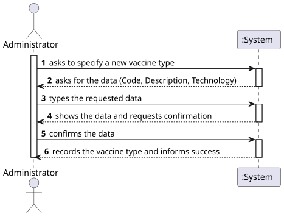
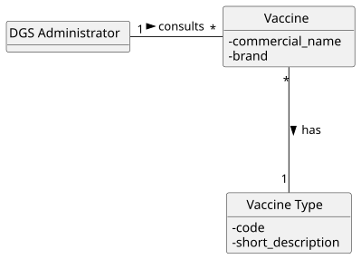
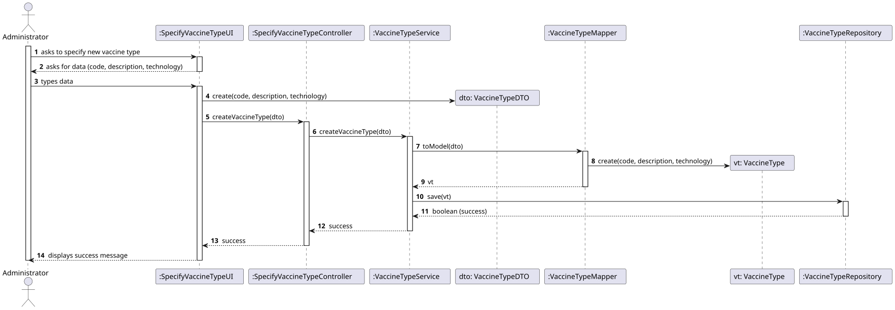
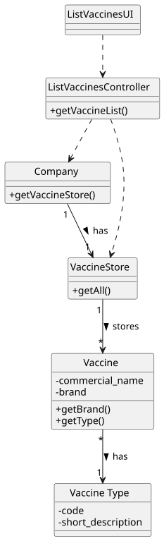

# US 12 - List all vaccines

## 1. Requirements Engineering

### 1.1. User Story Description

As Administrator, I want to get a list of all vaccines.

### 1.2. Customer Specifications and Clarifications

**From the specifications document:**

>  As Administrator, I want to get a list of all vaccines.

**From the client clarifications:**

> n/a (No specific clarifications provided in the forum for this US. Standard business rules apply).

### 1.3. Acceptance Criteria

- AC12-1: The vaccines should be grouped by type and then listed alphabetically by brand.

### 1.4. Found out Dependencies

- US13 (Register a Vaccination Center): Although not a direct dependency for listing, this functionality is usually part of the administrative management features.
- US01 (Register a Vaccine): Vaccines must exist in the system to be listed.

### 1.5 Input and Output Data

**Input Data:**

- n/a (The user just requests the list)

**Output Data:**

- List of registered vaccines (grouped by type and sorted by brand)

### 1.6. System Sequence Diagram (SSD)

### 1.7 Other Relevant Remarks

- n/a

## 2. OO Analysis

### 2.1. Relevant Domain Model Excerpt

### 2.2. Other Remarks

- The DGS Administrator interacts with the system to consult the Vaccine data.
- Each Vaccine has a Vaccine Type, which is the key for grouping the list.

## 3. Design - User Story Realization

### 3.1. Rationale

| Interaction ID | Question: Which class is responsible for... | Answer | Justification (with patterns) |
|:--- |:--- |:--- |:--- |
| Step 1 | ... interacting with the actor? | ListVaccinesUI | Pure Fabrication: responsible for user interaction (View). |
| | ... coordinating the US? | ListVaccinesController | Controller: coordinates the use case logic. |
| Step 2 | ... accessing the vaccine data? | VaccineStore | IE: Owns the collection of all vaccines. |
| | ... knowing the VaccineStore? | Company | IE: The Company is the root entity that manages domain containers. |
| | ... retrieving the list of vaccines? | ListVaccinesController | Controller: asks the store for the data. |
| Step 3 | ... sorting and grouping the data? | ListVaccinesController | Pure Fabrication/Logic: The controller (or a dedicated service) processes the raw list to satisfy AC12-1 (Group by Type, Sort by Brand). |
| Step 4 | ... showing the list to the user? | ListVaccinesUI | IE: responsible for user interaction. |

### Systematization

According to the taken rationale, the conceptual classes promoted to software classes are:

- Company
- Vaccine
- Vaccine Type

Other software classes (i.e. Pure Fabrication) identified:

- ListVaccinesUI
- ListVaccinesController
- VaccineStore

### 3.2. Sequence Diagram (SD)

### 3.3. Class Diagram (CD)

## 4. Tests

**Test 1:** Check that the list is empty when no vaccines exist.

    TEST_F(VaccineStoreFixture, GetAllEmpty){
        EXPECT_TRUE(store->getAll().isEmpty());
    }

**Test 2:** Check that the controller correctly sorts/groups the vaccines (Simulated Logic).

    // Assuming a list with: 
    // V1 (Type: Covid, Brand: Pfizer)
    // V2 (Type: Flu, Brand: A)
    // V3 (Type: Covid, Brand: Moderna)
    
    // Expected Order: 
    // Group 1 (Covid): Moderna, Pfizer (Alphabetical by Brand)
    // Group 2 (Flu): A

    TEST_F(ListVaccinesControllerFixture, SortAndGroupLogic){
        // Setup mock data...
        // Execute sorting method...
        // Assert order...
    }

## 5. Construction (Implementation)

- The sorting algorithm can be implemented using std::sort with a custom comparator or by inserting elements into a std::map<VaccineType, std::vector<Vaccine>> which automatically handles grouping.

## 6. Integration and Demo

A menu option on the Administrator's console menu was added.

    int AdminMenuView::processMenuOption(int option) {
        
        case 1: 
            view = new ListVaccinesUI();
            view->show();
            break;
        
    }

## 7. Observations

- Ideally, the sorting logic could be moved to a DTO mapper or a specific Service class if the complexity increases, keeping the Controller lighter.