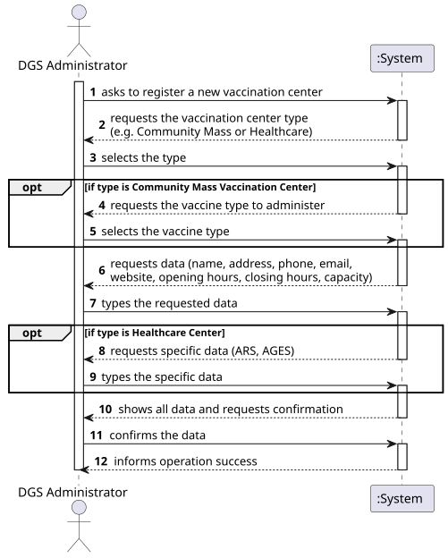
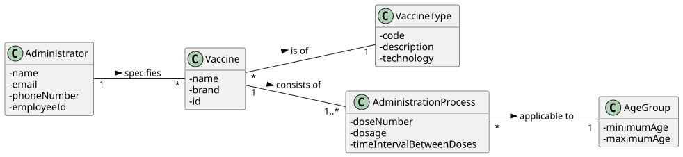
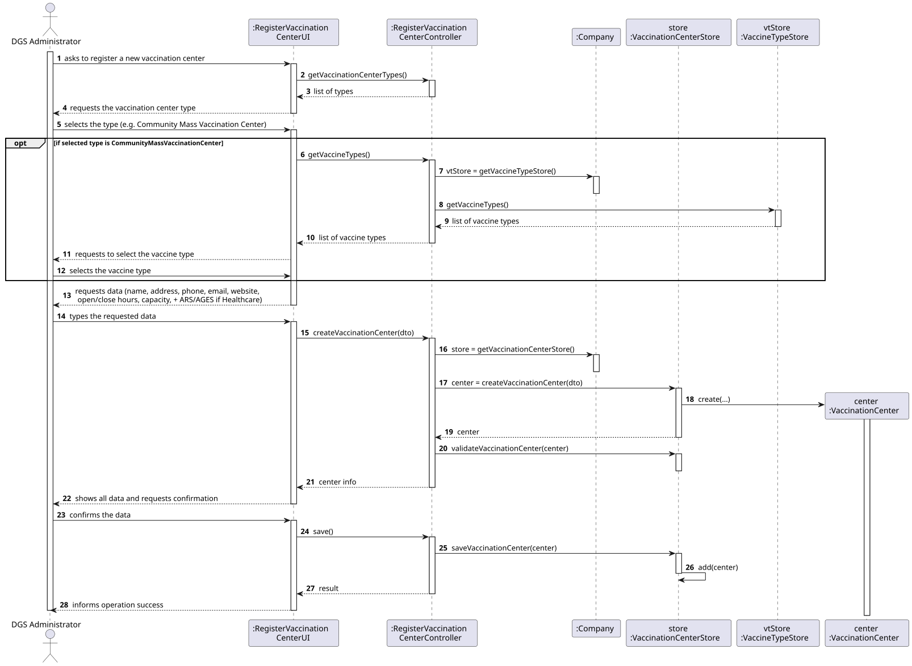
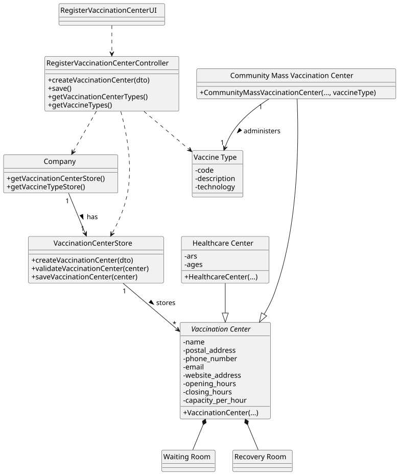

# US 13 - Register a Vaccination Center

## 1. Requirements Engineering

### 1.1. User Story Description

As DGS Administrator, I want to register a vaccination center.

### 1.2. Customer Specifications and Clarifications

**From the specifications document:**

> The system must allow the registration of different types of vaccination centers, such as Healthcare Centers and Community Mass Vaccination Centers.

**From the client clarifications:**

> **Question:** Does the vaccination center have an ID?
>
> **Answer:** Vaccination centers do not have an identifier (ID). During the center creation process, a name must be entered, which must be unique relative to all registered centers.
>
> **Question:** Is there a fixed opening and closing time?
>
> **Answer:** Each center autonomously establishes its opening and closing hours.

### 1.3. Acceptance Criteria

- AC13-1: The vaccination center name must be unique within the system.
- AC13-2: The vaccination center must be classified as either a Healthcare Center or a Community Mass Vaccination Center.
- AC13-3: Required fields (name, address, phone number, email, website, opening/closing hours, slot duration, max vaccines per slot) cannot be empty.
- AC13-4: If the center is a Healthcare Center, ARS and AGES must be specified.

### 1.4. Found out Dependencies

- n/a

### 1.5 Input and Output Data

**Input Data:**

- Typed data:
    - name
    - postal address
    - phone number
    - email address
    - website address
    - opening hours
    - closing hours
    - slot duration
    - maximum number of vaccines per slot
    - ARS (only for Healthcare Center)
    - AGES (only for Healthcare Center)

- Selected data:
    - Type of Vaccination Center (Healthcare Center / Community Mass Vaccination Center)

**Output Data:**

- (In)success of the operation

### 1.6. System Sequence Diagram (SSD)

### 1.7 Other Relevant Remarks

- The creation of a Vaccination Center implies the existence of physical resources such as a Waiting Room and a Recovery Room (Composition relationship in the Domain Model).

## 2. OO Analysis

### 2.1. Relevant Domain Model Excerpt

### 2.2. Other Remarks

- We apply the inheritance pattern where Healthcare Center and Community Mass Vaccination Center inherit from the abstract class Vaccination Center.
- A composition relationship exists: A Vaccination Center has a Waiting Room and a Recovery Room.

## 3. Design - User Story Realization

### 3.1. Rationale

| Interaction ID | Question: Which class is responsible for... | Answer | Justification (with patterns) |
|:--- |:--- |:--- |:--- |
| Step 1 | ... interacting with the actor? | RegisterVaccinationCenterUI | Pure Fabrication: responsible for user interaction (View). |
| | ... coordinating the US? | RegisterVaccinationCenterController | Controller: coordinates the use case logic. |
| Step 2 | ... knowing the available center types? | RegisterVaccinationCenterController | Controller: can provide the list of supported subclasses (or ask the System/Company). |
| | ... requesting the center type? | RegisterVaccinationCenterUI | IE: responsible for user interaction. |
| Step 3 | ... requesting the common data? | RegisterVaccinationCenterUI | IE: responsible for user interaction. |
| Step 4 | ... saving the inputted data? | RegisterVaccinationCenterUI | IE: temporarily keeps the data inputted by the user. |
| Step 5 | ... instantiating a new vaccination center? | VaccinationCenterStore | Creator/Pure Fabrication: By applying HC + LC, `Company` delegates the management of centers to a dedicated Store. |
| | ... knowing the VaccinationCenterStore? | Company | IE: The Company is the root entity that manages domain containers. |
| | ... creating the specific object (Healthcare vs Community)? | VaccinationCenterStore | Polymorphism/Creator: The store acts as a Factory to create the correct instance based on the selected type. |
| | ... validating the data (local validation)? | Vaccination Center (and subclasses) | IE: The object itself validates its own attributes (e.g., checking format of email/phone). |
| | ... validating the data (global validation)? | VaccinationCenterStore | IE: Knows all existing centers and can check for duplicates (AC13-1). |
| Step 6 | ... saving the created center? | VaccinationCenterStore | IE: Owns the collection/list of vaccination centers. |
| Step 7 | ... informing operation success? | RegisterVaccinationCenterUI | IE: responsible for user interaction. |

### Systematization

According to the taken rationale, the conceptual classes promoted to software classes are:

- Company
- Vaccination Center (abstract)
- Healthcare Center
- Community Mass Vaccination Center

Other software classes (i.e. Pure Fabrication) identified:

- RegisterVaccinationCenterUI
- RegisterVaccinationCenterController
- VaccinationCenterStore

### 3.2. Sequence Diagram (SD)

### 3.3. Class Diagram (CD)

## 4. Tests

**Test 1:** Check that it is possible to create an instance of Healthcare Center with valid values.

    TEST_F(HealthcareCenterFixture, CreateValidHealthcareCenter){
        EXPECT_NO_THROW(new HealthcareCenter(L"Centro Porto", ..., L"ARS Norte", L"Agrupamento X"));
    }

**Test 2:** Check that it is not possible to create a center with an empty name (validates AC13-3).

    TEST_F(VaccinationCenterFixture, CreateWithEmptyName){
        EXPECT_THROW(new CommunityMassVaccinationCenter(L"", ...), std::invalid_argument);
    }

**Test 3:** Check that the store rejects saving a center with a duplicate name (validates AC13-1).

    TEST_F(VaccinationCenterStoreFixture, FailToSaveDuplicateCenter){
        shared_ptr<VaccinationCenter> c1 = this->store->createHealthcareCenter(L"Centro Lisboa", ...);
        this->store->save(c1);

        shared_ptr<VaccinationCenter> c2 = this->store->createCommunityCenter(L"Centro Lisboa", ...);

        EXPECT_THROW(this->store->validate(c2), std::runtime_error); 
    }

## 5. Construction (Implementation)

- n/a

## 6. Integration and Demo

A menu option on the Administrator's console menu was added.

    int AdminMenuView::processMenuOption(int option) {
        case 1: 
            view = new RegisterVaccinationCenterUI();
            view->show();
            break;
        
    }

## 7. Observations

- The VaccinationCenterStore was introduced as a Pure Fabrication to reduce the coupling and responsibility of the Company class, following the High Cohesion / Low Coupling principles.