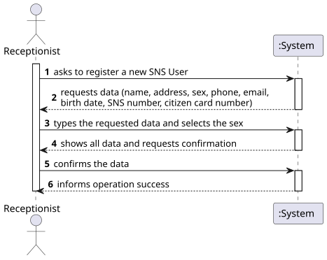
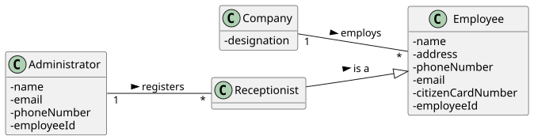
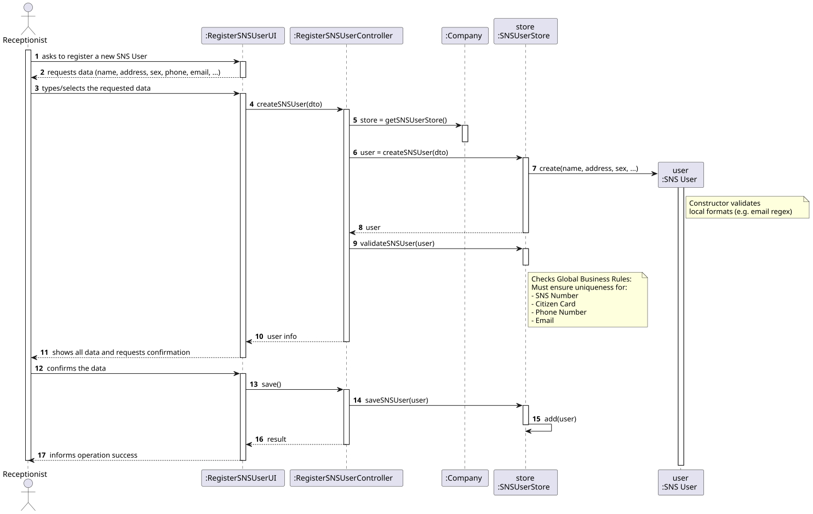
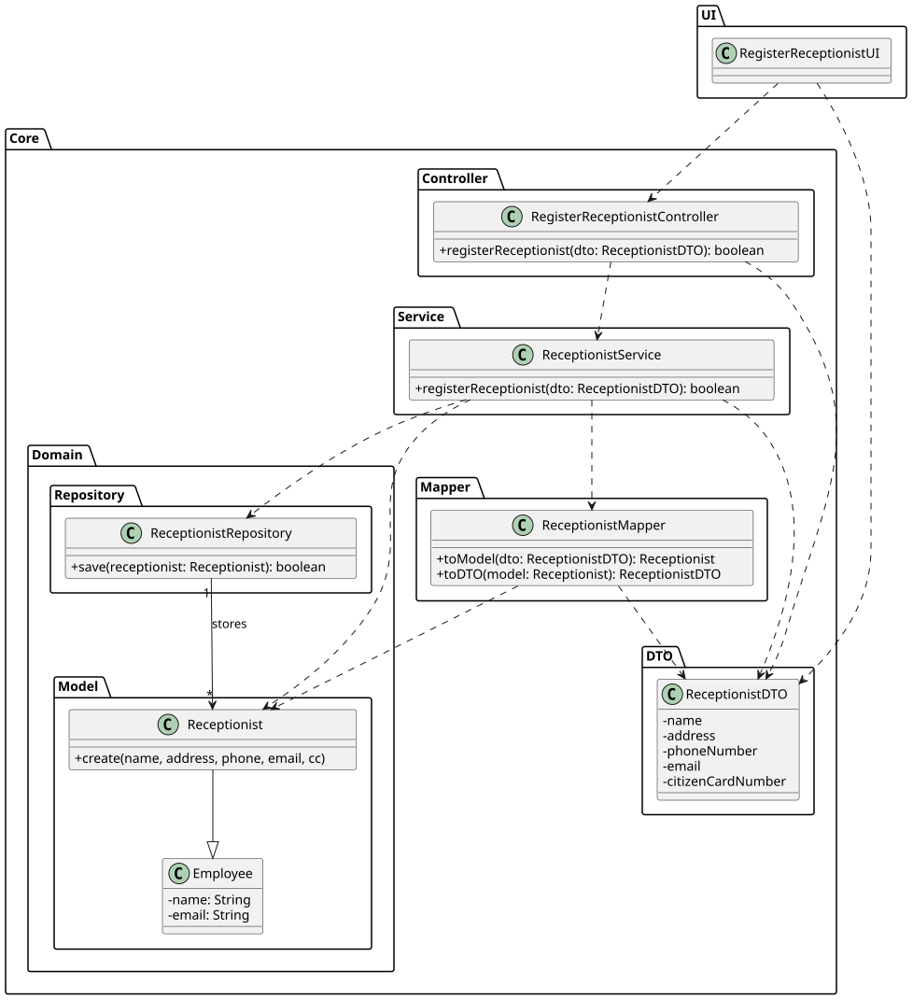

# US 20 - Register an SNS User

## 1. Requirements Engineering

### 1.1. User Story Description

As Receptionist, I want to register an SNS user.

### 1.2. Customer Specifications and Clarifications

**From the specifications document:**

> The Receptionist registers SNS Users to allow them to use the system (e.g., for scheduling vaccinations).

**From the client clarifications:**

> **Question:** For the user identification code within the system, do we consider the SNS user number as the unique identifier?
>
> **Answer:** Phone Number, E-mail Address, Citizen Card Number, and SNS User Number must be unique across all registered SNS users. Therefore, any of these can serve as a unique identifier.

> **Question:** Can we consider the "Sex" attribute as selected data?
>
> **Answer:** Yes. The options "Male / Female / Prefer not to say" fit particularly well.

> **Question:** Does each SNS user have an associated health history in the system?
>
> **Answer:** No. The system does not store health history when an SNS user is registered.

### 1.3. Acceptance Criteria

- AC20-1: The SNS User's Phone Number, Email, Citizen Card Number, and SNS User Number must be unique within the system.
- AC20-2: The Sex attribute must be selected from a predefined list (Male, Female, Prefer not to say).
- AC20-3: All required fields (Name, Address, Birth Date, etc.) cannot be empty.
- AC20-4: The birth date must be a valid date in the past.

### 1.4. Found out Dependencies

- n/a

### 1.5 Input and Output Data

**Input Data:**

- Typed data:
    - Name
    - Postal Address
    - Birth Date
    - Phone Number
    - E-mail
    - Citizen Card Number
    - SNS User Number

- Selected data:
    - Sex (Male / Female / Prefer not to say)

**Output Data:**

- (In)success of the operation

### 1.6. System Sequence Diagram (SSD)

### 1.7 Other Relevant Remarks

- Although the "Prefer not to say" option exists, the attribute itself is handled as an enumeration or specific selection in the system to ensure data consistency.

## 2. OO Analysis

### 2.1. Relevant Domain Model Excerpt

### 2.2. Other Remarks

- The Receptionist is the actor initiating the registration.
- The SNS User class aggregates all personal information.

## 3. Design - User Story Realization

### 3.1. Rationale

| Interaction ID | Question: Which class is responsible for... | Answer | Justification (with patterns) |
|:--- |:--- |:--- |:--- |
| Step 1 | ... interacting with the actor? | RegisterSNSUserUI | Pure Fabrication: responsible for user interaction (View). |
| | ... coordinating the US? | RegisterSNSUserController | Controller: coordinates the use case logic. |
| Step 2 | ... requesting the data? | RegisterSNSUserUI | IE: responsible for user interaction. |
| Step 3 | ... saving the inputted data? | RegisterSNSUserUI | IE: temporarily keeps the data inputted by the user. |
| Step 4 | ... instantiating a new SNS User? | SNSUserStore | Creator/Pure Fabrication: By applying HC + LC, `Company` delegates the management of users to a dedicated Store. |
| | ... knowing the SNSUserStore? | Company | IE: The Company is the root entity that manages domain containers. |
| | ... validating the data (local validation)? | SNS User | IE: The object itself validates its own attributes (e.g., email format, birth date). |
| | ... validating the data (global validation)? | SNSUserStore | IE: Knows all existing users and must check for duplicates of Email, Phone, SNS Number, and CC Number (AC20-1). |
| Step 5 | ... saving the created user? | SNSUserStore | IE: Owns the collection/list of SNS users. |
| Step 6 | ... informing operation success? | RegisterSNSUserUI | IE: responsible for user interaction. |

### Systematization

According to the taken rationale, the conceptual classes promoted to software classes are:

- Company
- SNS User
- Receptionist

Other software classes (i.e. Pure Fabrication) identified:

- RegisterSNSUserUI
- RegisterSNSUserController
- SNSUserStore

### 3.2. Sequence Diagram (SD)

### 3.3. Class Diagram (CD)

## 4. Tests

**Test 1:** Check that it is possible to create an instance of SNS User with valid values.

    TEST_F(SNSUserFixture, CreateValidUser){
        EXPECT_NO_THROW(new SNSUser(L"Joao Silva", L"Rua A", L"Male", L"912345678", L"joao@email.com", L"1990-01-01", L"123456789", L"987654321"));
    }

**Test 2:** Check that it is not possible to create a user with an invalid/empty name.

    TEST_F(SNSUserFixture, CreateWithEmptyName){
        EXPECT_THROW(new SNSUser(L"", L"Rua A", ...), std::invalid_argument);
    }

**Test 3:** Check that the store rejects saving a user with a duplicate SNS Number (validates AC20-1).

    TEST_F(SNSUserStoreFixture, FailToSaveDuplicateSNS){
        
        shared_ptr<SNSUser> u1 = this->store->create(..., L"123456789", ...); // SNS Num: 123456789
        this->store->save(u1);
        
 
        shared_ptr<SNSUser> u2 = this->store->create(..., L"123456789", ...);

       
        EXPECT_THROW(this->store->validate(u2), std::runtime_error); 
    }

## 5. Construction (Implementation)

- n/a

## 6. Integration and Demo

A menu option on the Receptionist's console menu was added.

    int ReceptionistMenuView::processMenuOption(int option) {
        
        case 1: 
            view = new RegisterSNSUserUI();
            view->show();
            break;
        
    }

## 7. Observations

- The SNSUserStore was used to decouple the Company from the specific logic of managing SNS users, facilitating testing and maintenance.