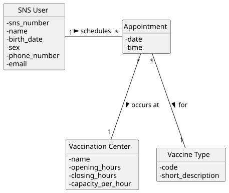

# US 30 - Schedule a Vaccine Administration

## 1. Requirements Engineering

### 1.1. User Story Description

As SNS User, I intend to use the application to schedule a vaccine administration.

### 1.2. Customer Specifications and Clarifications

**From the specifications document:**

> The SNS User should be able to schedule a vaccination appointment at a specific Vaccination Center. The system must verify if there is availability (capacity) for the chosen time slot.

**From the client clarifications:**

> **Question:** When a receptionist schedules a vaccination on behalf of an SNS user, is this done using the receptionist's profile or the user's?
>
> **Answer:** The US30 establishes that the SNS user schedules the administration for themselves. In the case of face-to-face support where a receptionist is involved, the registration is done through the receptionist's profile/account (acting as staff), but the core scheduling logic remains similar.

### 1.3. Acceptance Criteria

- AC30-1: The system must present a list of available vaccination centers to the user.
- AC30-2: The system must allow the selection of a vaccine type (if applicable/required by the center).
- AC30-3: The user must select a date and time slot.
- AC30-4: The system must check the center's capacity for the selected slot before confirming the schedule.
- AC30-5: An appointment cannot be scheduled if the slot is full.

### 1.4. Found out Dependencies

- US13 (Register a Vaccination Center): Centers must exist to be selected.
- US10/US11 (Vaccine Types): Vaccine types must exist.
- US20 (Register SNS User): The user must be registered to schedule an appointment.

### 1.5 Input and Output Data

**Input Data:**

- Selected data:
    - Vaccination Center
    - Vaccine Type (optional/context dependent)
    - Date
    - Time Slot

**Output Data:**

- List of available centers
- List of available slots
- Appointment confirmation (success/failure)

### 1.6. System Sequence Diagram (SSD)

### 1.7 Other Relevant Remarks

- The validation of "slots" implies checking the`capacity_per_hour of the center against the number of existing appointments for that specific time block.

## 2. OO Analysis

### 2.1. Relevant Domain Model Excerpt

### 2.2. Other Remarks

- The Appointment connects the SNS User to a Vaccination Center and a Vaccine Type.
- The Vaccination Center is responsible for managing its own schedule availability.

## 3. Design - User Story Realization

### 3.1. Rationale

| Interaction ID | Question: Which class is responsible for... | Answer | Justification (with patterns) |
|:--- |:--- |:--- |:--- |
| Step 1 | ... interacting with the actor? | ScheduleVaccineUI | Pure Fabrication: responsible for user interaction (View). |
| | ... coordinating the US? | ScheduleVaccineController | Controller: coordinates the use case logic. |
| Step 2 | ... knowing the vaccination centers? | VaccinationCenterStore | IE: Stores and manages all vaccination centers. |
| | ... providing the list of centers? | ScheduleVaccineController | Controller: fetches data from the store to show in UI. |
| Step 3 | ... knowing the vaccine types? | VaccineTypeStore | IE: Stores and manages vaccine types. |
| Step 4 | ... knowing the available slots? | Vaccination Center | IE: The center knows its `capacity` and its current `appointments`, so it can calculate availability. |
| Step 5 | ... instantiating a new Appointment? | Vaccination Center | Creator: The `Vaccination Center` aggregates `Appointment` objects. It closely manages them. |
| | ... validating the slot availability (local validation)? | Vaccination Center | IE: It has the data (capacity vs. current count) to validate if a slot is free. |
| Step 6 | ... saving the appointment? | Vaccination Center | IE: The appointment is stored "inside" (or associated with) the center context. |
| Step 7 | ... informing operation success? | ScheduleVaccineUI | IE: responsible for user interaction. |

### Systematization

According to the taken rationale, the conceptual classes promoted to software classes are:

- Vaccination Center
- Appointment
- SNS User
- Vaccine Type

Other software classes (i.e. Pure Fabrication) identified:

- ScheduleVaccineUI
- ScheduleVaccineController
- VaccinationCenterStore
- VaccineTypeStore

### 3.2. Sequence Diagram (SD)

### 3.3. Class Diagram (CD)

## 4. Tests

**Test 1:** Check that an appointment can be created if there is capacity.

    TEST_F(VaccinationCenterFixture, CreateAppointmentSuccess){
        // Center with capacity 5
        Date d(2025, 12, 25);
        Time t(10, 0);
        EXPECT_NO_THROW(center->createAppointment(user, type, d, t));
    }

**Test 2:** Check that an appointment fails if the slot is full (Capacity limit).

    TEST_F(VaccinationCenterFixture, FailAppointmentFullCapacity){
        for(int i=0; i<center->getCapacity(); i++){
             center->createAppointment(users[i], type, date, time);
        }
        EXPECT_THROW(center->createAppointment(extraUser, type, date, time), std::runtime_error);
    }

**Test 3:** Check that valid slots are correctly identified.

    TEST_F(VaccinationCenterFixture, CheckAvailableSlots){
        List<Time> slots = center->getAvailableSlots(date);
        EXPECT_FALSE(slots.isEmpty());
    }

## 5. Construction (Implementation)

- n/a

## 6. Integration and Demo

A menu option on the SNS User's console menu was added.

    int SNSUserMenuView::processMenuOption(int option) {
        case 1: 
            view = new ScheduleVaccineUI();
            view->show();
            break;
    }

## 7. Observations

- Delegating the createAppointment responsibility to the Vaccination Center (Creator Pattern) ensures that the center always maintains a valid state regarding its capacity and schedule.