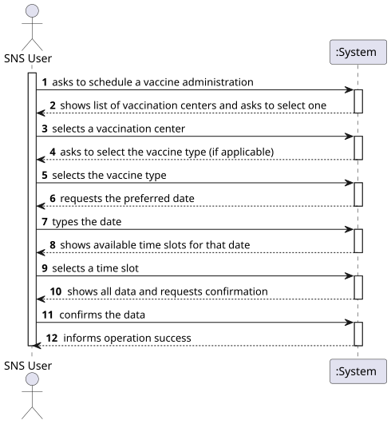
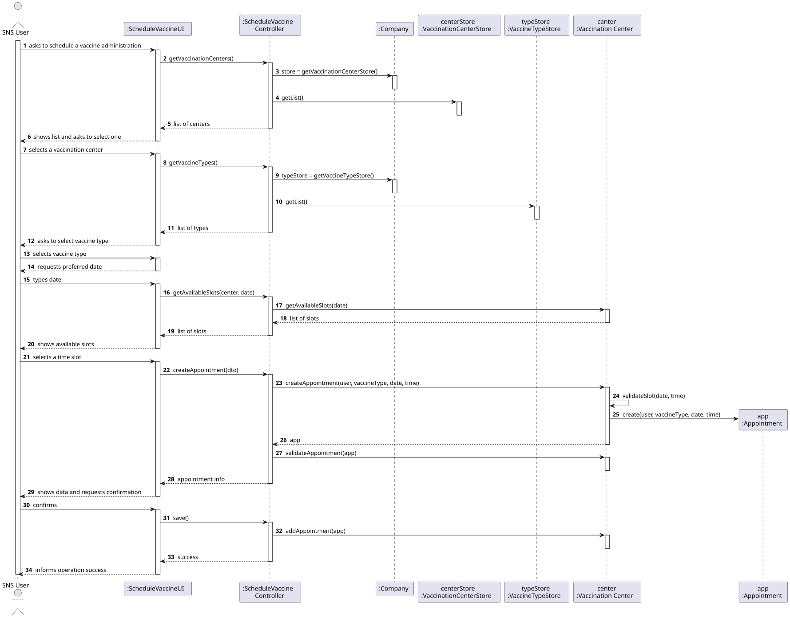
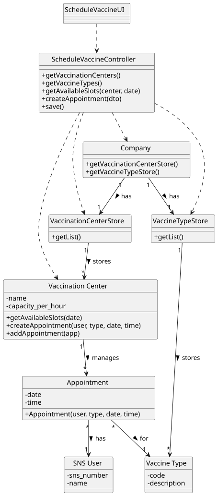

# US30 - Load SNS Users from CSV

## 1. Requirements Engineering

### 1.1. User Story Description

As an Administrator, I want to load a list of SNS Users from a CSV file.

### 1.2. Acceptance Criteria

* **AC1:** The CSV file must have a specific header/structure.
* **AC2:** The system should validate each user entry (e.g., valid SNS number, email).
* **AC3:** Duplicate users (by SNS number) should be skipped or updated (business rule dependent).
* **AC4:** The system must report how many users were successfully loaded.

### 1.3. Found out Dependencies

* **US02:** Register SNS User (manual registration logic shares validation rules).

### 1.4 Input and Output Data

**Input Data:**
* Typed data:
  * File Path (e.g., "data/users.csv")

**Output Data:**
* Number of successfully imported records.
* Error log (optional for invalid lines).

---

## 2. Analysis

### 2.1. Domain Model (MD)


---

## 3. Design

### 3.1. Realization of Functionality

The design follows the **Layered Architecture** with **Service** pattern to handle the bulk operation:

1. **UI**: Asks for the file path.
2. **Controller**: Passes the path to the Service.
3. **Service**:
  * Uses a `CSVReader` utility to parse the file into raw lines/tokens.
  * Iterates through the data.
  * Creates `SNSUserDTO`s for temporary data holding.
  * Uses `SNSUserMapper` to convert DTOs to Domain Objects (`SNSUser`).
  * Calls `SNSUserRepository` to save each valid user.
4. **Repository**: Persists the users in memory/database.

### 3.2. Sequence Diagram (SD) Rationale

| Interaction ID | Question: Which class... | Answer | Justification (with Patterns) |
| :--- | :--- | :--- | :--- |
| **Step 1** | ... interacts with the actor? | `LoadUsersUI` | **Pure Fabrication**: Handles user input. |
| **Step 2** | ... coordinates the flow? | `LoadUsersController` | **Controller**: Entry point. |
| **Step 3** | ... processes the file? | `LoadUsersService` | **Service Layer**: Encapsulates the business logic of importing multiple records. |
| **Step 4** | ... reads the file physicaly? | `CSVReader` | **High Cohesion**: Dedicated utility for file I/O. |
| **Step 5** | ... creates domain objects? | `SNSUserMapper` | **Creator/Pure Fabrication**: Handles conversion logic. |
| **Step 6** | ... stores the data? | `SNSUserRepository` | **Repository**: Manages collection of users. |

### 3.3. System Diagram (SSD)



### 3.4. Sequence Diagram (SD)



### 3.5. Class Diagram (CD)



---

## 4. Tests

**Test 1:** Check if `LoadUsersService` correctly counts imported users from a dummy file.

```cpp
TEST(LoadUsersService, ImportFromCSV) {
    // Mock Repository
    // Create temporary CSV file
    // Service.loadUsers("temp.csv")
    // EXPECT_EQ(count, 3);
}